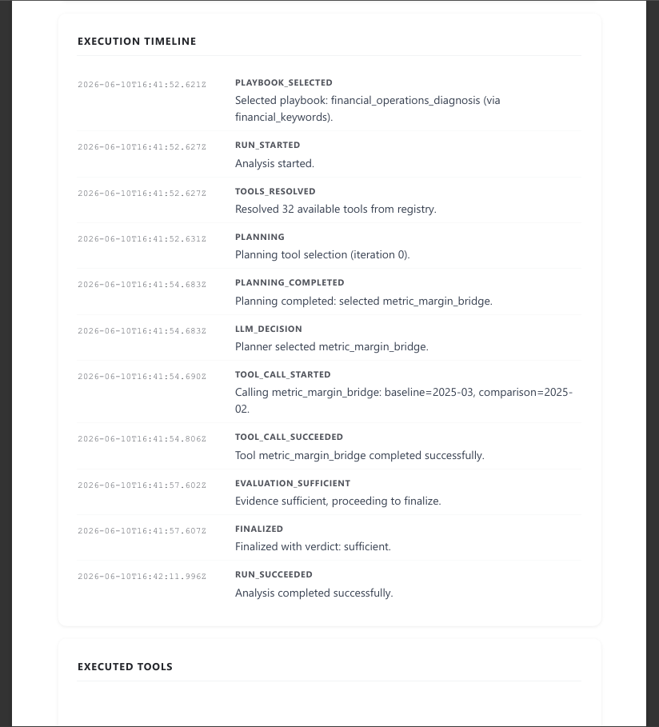

## Executive Decision Intelligence Platform

**Type:** Enterprise AI / Decision-support platform / Agentic analytics MVP
**Role:** Solution Architect, System Designer, AI-assisted Prototype Engineer
**Status:** Working MVP prototype, June 2026

### Context

An enterprise AI prototype for evidence-based managerial analytics.

The system is designed around a simple principle: the LLM does not “answer from memory” and does not get direct access to business data. Instead, it operates inside a controlled execution loop: it selects a diagnostic playbook, calls permitted backend tools, retrieves structured metrics and document evidence, preserves the execution trace, and generates an executive-level answer grounded in verifiable data.

The product direction is an **AI Executive Analyst with verifiable evidence**: a decision-support layer that helps executives and domain owners investigate business questions, detect operational risks, explain deviations, and prepare management actions without relying on opaque AI reasoning.

### Problem

Typical executive analytics requires manual work across BI reports, spreadsheets, task trackers, meeting notes, documents, and domain experts. LLMs can help with synthesis, but a free-form chat over corporate data is unsafe and unreliable: it can hallucinate, lose context, call the wrong data source, or produce conclusions that cannot be audited.

This project explores how to make LLM-based managerial analytics controlled, traceable, and useful for enterprise environments.

### Responsibilities

* Designed the overall architecture of the MVP: chat harness, agent runtime, playbook routing, tool gateway, tool registry, structured data layer, document RAG layer, and execution trace.
* Built a LangGraph/FastAPI-based laboratory agent runtime for controlled diagnostic workflows.
* Defined the playbook-based approach: each business domain exposes a bounded set of allowed tools, diagnostic steps, constraints, and expected evidence.
* Designed the controlled tool access model where the LLM never queries PostgreSQL, Qdrant, or MinIO directly.
* Implemented and evolved the Tool Registry concept as a machine-readable catalog of available tools, schemas, domains, constraints, and allowed playbooks.
* Prepared synthetic enterprise demo data for a fashion/retail/manufacturing company, including financial, delivery, ITSM, PMO, meetings, documents, and scenario-based anomalies.
* Developed the evidence and transparency approach: selected playbook, tool calls, parameters, tool results, execution timeline, run details, and JSON-level debug visibility.
* Configured Open WebUI as a temporary chat interface for MVP demonstration.
* Shaped the product direction toward executive reports, signal cards, evidence graphs, proactive alerts, and future backend-native orchestration.

### Key Architectural Decisions

* **Controlled LLM execution instead of free chat.**
  The LLM reasons and plans, but data access is delegated to controlled backend tools.

* **Backend as control plane.**
  The backend defines available tools, permissions, validation rules, execution boundaries, auditability, and response structure.

* **Tool Gateway pattern.**
  All data access goes through controlled HTTP tools with explicit input contracts, validation, structured output, and metadata.

* **Playbook-based diagnostics.**
  The system routes questions to domain-specific diagnostic playbooks instead of exposing all tools to the LLM at once.

* **Evidence-first answers.**
  Final responses must be based on tool outputs, document evidence, calculations, or explicitly stated limitations.

* **Run trace as a trust layer.**
  Each diagnostic run preserves the selected playbook, tool calls, parameters, outputs, and reasoning checkpoints for debugging and audit.

* **Lab runtime separated from target architecture.**
  LangGraph and Open WebUI are used as fast MVP/lab tools. The target product architecture assumes a backend-native control plane, dedicated UI, Tool Gateway, semantic layer, report service, and audit trail.

### Implemented MVP Capabilities

* Chat-based executive query interface through Open WebUI.
* LangGraph/FastAPI `agent-lab` runtime for diagnostic workflows.
* Tool-server layer for controlled backend tool execution.
* Tool Registry concept for tool discovery and playbook constraints.
* Financial Operations playbook for margin, revenue, discounts, COGS, and product mix diagnostics.
* Executive Operations / Delivery-oriented playbook for roadmap, delivery, ITSM, PMO, meetings, tasks, and KPI anomaly analysis.
* Synthetic enterprise dataset with connected business domains.
* PostgreSQL-backed metric tools.
* Qdrant/MinIO-backed document evidence direction for RAG.
* Playbook routing based on user intent.
* Execution timeline and run details for transparency.
* Same-language response handling for user-facing answers.
* Initial guardrails against wrong fallback behavior, repeated tool calls, and unsupported analysis paths.

### Demo Scenarios

#### Financial Performance Diagnosis

Example question:

> Why did gross margin drop in March?

The system selects a financial diagnostic playbook, calls metric tools for gross margin, revenue, discounts, COGS, and product mix, then produces an executive summary with evidence and limitations.

#### Operational / KPI Anomaly Diagnosis

Example question:

> Why is time-to-market unstable while local team KPIs look normal?

The system selects an operational diagnostic playbook and investigates delivery, PMO, ITSM, meeting decisions, and related evidence to detect cross-functional bottlenecks that are not visible in isolated KPI dashboards.

#### Cross-Domain Management Hypothesis

Target scenario:

> Identify the top problematic projects, explain the selection criteria, describe the issue for each project, and prepare a meeting agenda for product owners.

This scenario demonstrates the intended product direction: not just retrieving delayed tasks, but turning structured and document evidence into a management-ready diagnostic brief.

### UI Screenshots

#### "What can you do?"

<figure markdown>

<figcaption>Available playbooks and tools</figcaption>
</figure>

#### Financial playbook: gross margin drop hypothesis

<figure markdown>

<figcaption>Financial performance diagnosis with tool-based evidence</figcaption>
</figure>

<figure markdown>

<figcaption>Financial performance diagnosis chars report</figcaption>
</figure>

<figure markdown>

<figcaption>Financial performance diagnosis called tools</figcaption>
</figure>

#### Executive Operations playbook: KPI anomaly

<figure markdown>

<figcaption>Operational anomaly diagnosis across delivery, ITSM, PMO, and documents</figcaption>
</figure>

### Technology Stack

**Agent runtime:** LangGraph, FastAPI, Python
**Interface:** Open WebUI as temporary demo harness
**Data layer:** PostgreSQL, Qdrant, MinIO, Redis
**AI integration:** OpenAI-compatible LLM API, prompt-based workflow control
**Architecture patterns:** Tool Gateway, Tool Registry, playbook-based diagnostics, RAG, semantic layer, run trace, evidence trail
**Development approach:** AI-assisted prototyping, synthetic data generation, scenario-driven MVP validation

## What This Project Demonstrates

This project demonstrates my ability to move from classical systems analysis into enterprise AI solution architecture.

It shows that I can take an ambiguous AI product idea and turn it into a working, constrained, and demonstrable system: define the architecture, model the data, design diagnostic workflows, build a prototype, prepare synthetic scenarios, expose controlled tools, and make LLM outputs traceable enough for enterprise discussion.

The core value is not "using an LLM". The core value is designing a system where AI reasoning is bounded by architecture, evidence, tool contracts, and auditability.