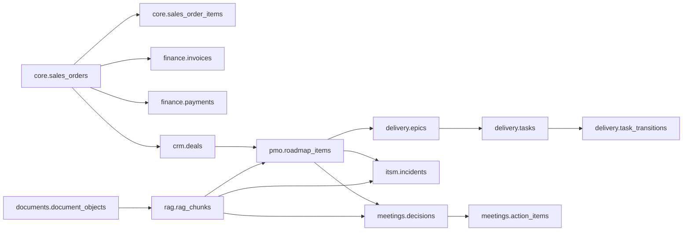

# System Model

## Domain Model

### Main entities

| Entity | Role |
|---|---|
| Executive User | Asks an analytical question and receives a prototype answer |
| Domain Owner | Intended reviewer of conclusions in a domain: finance, delivery, PMO, ITSM |
| Platform Admin | Target-system role for sources, access, diagnostic paths, and tools; not implemented in the PoC |
| Diagnostic path / playbook concept | Bounds the diagnostic process, available tools, and domain frame |
| Tool | Controlled operation over data: metric, RAG, aggregated result |
| Diagnostic Run | One analysis run with run details, selected path, tool history, and final answer |
| Evidence Item | Fact, calculation, document chunk, or limitation linked to a conclusion |
| Claim | Statement in the answer that should refer to evidence |

A diagnostic run in this prototype is a single-turn analytical request. The model does not describe a durable multi-turn conversation.

## Synthetic enterprise dataset

Prepared synthetic enterprise demo data for a fashion/retail/manufacturing company, conceptually extended toward `FashionCo Group / fashionco-enterprise`.

Company domain:

- premium apparel / small-to-medium manufacturing;
- B2B / B2B2C through distributors, boutiques, showrooms, and marketplace partners;
- data period: 2024-2025;
- business domains linked in one synthetic enterprise contour.

Connected business domains:

| Domain | Content |
|---|---|
| `core` | customers, products, sales orders, order items |
| `crm` | companies, contacts, deals, activities, tasks |
| `finance` | invoices, payments, accounts receivable, COGS |
| `production` | production orders, operations, materials, supplier deliveries |
| `documents` | document objects, invoice files, metadata |
| `rag` | RAG documents and chunks |
| `delivery` | epics, tasks, transitions, rework, cycle time |
| `itsm` | incidents, SLA, affected services, business impact |
| `pmo` | roadmap items, milestones, slippage, status reports |
| `meetings` | decisions, action items, decision-to-action gaps |
| `goals` | KPI, objectives, ownership, conflicts — target/extension |
| `semantic` | metric definitions, business entities, calculation rules |
| `system` | dataset version, runtime metadata |
| `eval` | scenario truth, expected claims, forbidden claims — not exposed to normal tools |

## Data Model

Simplified ERD logic:



## API Contracts

### Agent endpoint

```http
POST /agent/check-hypothesis
Content-Type: application/json
```

Example request:

```json
{
  "question": "Why did gross margin drop in March 2025?",
  "hypothesis": "The margin drop is related to discounts",
  "context": {
    "period": "2025-03",
    "domain": "finance"
  }
}
```

Example response:

```json
{
  "selected_playbook": "financial_operations",
  "verdict": "partially_supported",
  "final_answer": "...",
  "evidence": [
    {
      "type": "metric",
      "tool_id": "metric_gross_margin",
      "period": "2025-03",
      "summary": "gross margin decreased compared with baseline"
    }
  ],
  "tool_calls": [
    {
      "tool_id": "metric_gross_margin",
      "args": { "period": "2025-03" },
      "status": "ok"
    }
  ],
  "limitations": [
    "Analysis is based on synthetic dataset only"
  ]
}
```

The `selected_playbook` field reflects the prototype playbook-routing concept, not a complete playbook engine.

### Tool-server health

```http
GET /health
```

Purpose: tool-server availability check.

### Gross margin tool

```http
POST /tools/metric/gross-margin
Content-Type: application/json
```

Supported request forms:

```json
{ "period": "2025-03" }
```

```json
{ "start_date": "2025-02-01", "end_date": "2025-03-31", "group_by": ["month"] }
```

Calculation logic:

```text
revenue = SUM(core.sales_orders.net_amount_rub)
cogs = SUM(core.sales_orders.cogs_amount_rub)
gross_margin = revenue - cogs
gross_margin_rate = gross_margin / revenue
```

### RAG search tool

```http
POST /tools/rag-search
Content-Type: application/json
```

Example request:

```json
{
  "query": "Definition of Ready decision for the promo feature",
  "filters": {
    "domain": "delivery",
    "source_type": "meeting_minutes",
    "period": "2025-Q1"
  }
}
```

Expected response:

```json
{
  "status": "ok",
  "results": [
    {
      "document_id": "DOC-PMO-2025-03-12",
      "chunk_id": "CHUNK-001",
      "title": "PMO weekly meeting notes",
      "score": 0.82,
      "object_key": "executive-demo-docs/pmo/2025-03-12.md",
      "snippet": "..."
    }
  ]
}
```
