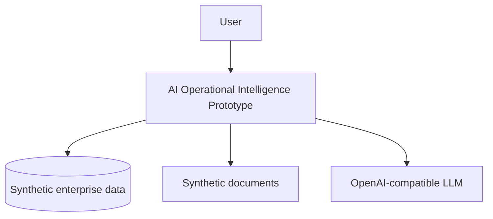
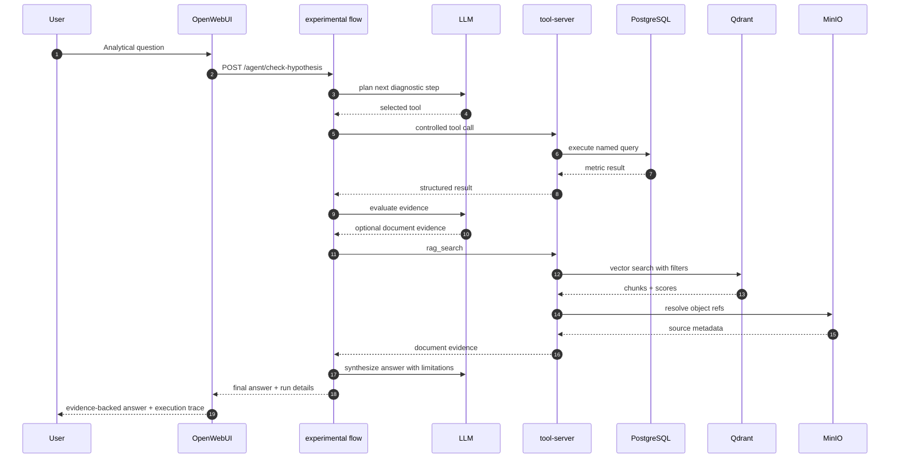

# Architecture and Integrations

## Architecture idea

The architecture describes a prototype flow, not a completed product architecture.

```text
User request
→ controlled execution flow
→ tool selection
→ backend tool call
→ structured result
→ evidence-backed answer
→ execution trace
```

The LLM was intended to act inside a controlled backend-mediated tool environment, not as a free-form chatbot with direct arbitrary data access.

```text
OpenWebUI
  → experimental LangGraph / FastAPI flow
  → tool selection / prototype playbook routing
  → Tool Registry concept
  → tool-server / Tool Gateway
  → PostgreSQL / Qdrant / MinIO
  → structured result
  → evidence-backed answer
  → execution trace
```

This is a single-request prototype loop. A second user message in Open WebUI was not treated as continuation of the same analytical session.

## Context diagram



The diagram shows the lab stand. Real ERP, ITSM, PMO, or document-system connectors were not implemented.

## Tool Gateway pattern

All data access goes through controlled HTTP tools with explicit input contracts, validation, structured output, and metadata.

## Prototype playbook concept

The prototype explored routing questions into domain-specific diagnostic paths instead of exposing all tools to the LLM at once.

Each domain was intended to expose a bounded set of allowed tools, diagnostic steps, constraints, and expected evidence. This was an experimental routing concept, not a complete playbook engine.

## Tool Registry

Implemented and evolved an initial Tool Registry / tool-description concept as a machine-readable catalog of available tools, schemas, domains, and constraints.

## One diagnostic run



The sequence describes one request. It does not describe a durable conversational loop.

## Integration principles

1. The LLM does not execute SQL.
2. The LLM does not read documents directly.
3. The LLM should not receive the full unrestricted tool list.
4. The backend / tool-server validates input parameters.
5. Tools return structured JSON, metadata, warnings, and status.
6. Evidence is linked to a tool call, document, period/entity, and claim where possible.
7. Debug visibility is available through run details and should not expose private chain-of-thought.

## Evidence-first answers

Final responses are expected to rest on tool outputs, document evidence, calculations, or explicitly stated limitations.

## Run trace as a trust layer

Each diagnostic run preserves, at a basic level, the selected diagnostic path, tool calls, parameters, outputs, and run details for debugging and discussion.

## Evidence and transparency approach

The prototype explored an evidence and transparency pattern: selected diagnostic path, tool calls, parameters, tool results, execution timeline, run details, and JSON-level debug visibility.
