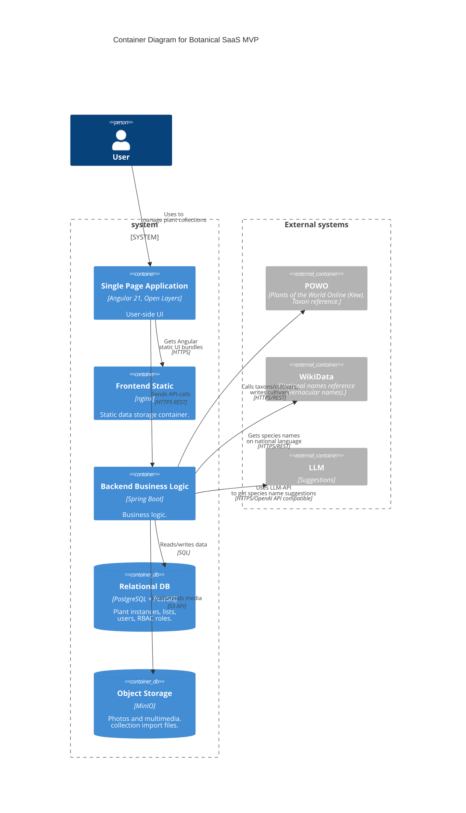

# Botanical SaaS 

**Status:** MVP / pilot preparation
**Role:** Co-founder, System Designer, Backend-oriented Engineer
**Platform:** Web SaaS
**Stack:** Java 21, Spring Boot, PostgreSQL/PostGIS, MinIO/S3-compatible storage, Angular, OpenLayers, Docker, LLM

## Summary

Botanical SaaS is a multi-tenant SaaS platform for botanical gardens, nurseries, plant breeders, and private plant collections.

The product replaces fragmented spreadsheets, local databases, and outdated desktop tools with a web-based system for managing living plant collections, scientific taxonomy, geospatial data, public collection pages, QR labels, imports, lists, and controlled data sharing.

My contribution covered domain modeling, backend architecture, access control design, data model design, API structure, technical documentation, hands-on backend implementation, and cloud-ready deployment preparation.

## Product Problem

Botanical collections are often managed through disconnected spreadsheets, local databases, and institution-specific workflows. This makes it difficult to:

* keep plant records consistent;
* link plants to verified taxonomy;
* track plant locations and lifecycle changes;
* manage access across departments and organizations;
* import historical data safely;
* publish selected collection data publicly;
* exchange information between institutions.

Botanical SaaS addresses this by providing a unified operational platform for living plant collections.

## My Role

I acted as a co-founder and technical owner of the system architecture.

My work included:

* translating domain knowledge into a structured SaaS domain model;
* designing the backend architecture, APIs, data structures, and service boundaries;
* implementing backend features and integration logic;
* designing tenant-aware access control and organization-scoped permissions;
* modeling plant instances, taxonomy, places, lists, photos, imports, and public pages;
* preparing architecture documentation, C4 diagrams, ADR-style decisions, and implementation context;
* coordinating technical decisions with a botanical domain expert;
* using AI-assisted development tools in a controlled workflow to accelerate routine implementation while keeping architecture, data model, API contracts, reviews, and deployment decisions under manual control.

## Key Implemented Capabilities

### Collection Management

The system supports accessioned plant records with metadata, status, provenance, growing conditions, custom fields, photos, lists, and lifecycle-related data.

It includes plant search, filtering, batch operations, soft delete, restore workflows, and Excel export.

### Scientific Taxonomy

Plant records are tied to a centralized taxonomy layer based on POWO/IPNI reference data.

The model supports family, genus, species, cultivars, grexes, global taxa, and tenant-owned local cultivated entities.

### Multi-tenancy and Access Control

The platform uses a soft multi-tenancy model based on a root organization unit pattern.

Users can belong to multiple organizations and have different roles depending on the current organization context. Access checks are enforced across service, repository, API, and UI layers.

### GIS and Mapping

The system treats spatial data as a core domain concern.

It supports geospatial plant and place data, PostGIS points and polygons, garden places, greenhouses, beds, map editing, plant positioning, and public map scenarios.

### Smart Import

The platform includes a guided spreadsheet import pipeline for existing plant collections.

The import flow supports file upload, sheet selection, column mapping, value resolution, fuzzy matching, asynchronous processing, row-level results, and error report export.

### Public Showcase

Organizations can expose selected data through public pages, public plant pages, public lists, QR-label targets, and a global map.

The public layer uses separate DTOs and visibility rules to avoid leaking internal fields.

### Infrastructure and Deployment

The project is designed as a practical cloud-ready MVP:

* separated frontend and backend;
* containerized services;
* PostgreSQL/PostGIS database;
* MinIO/S3-compatible media and import storage;
* Flyway-controlled schema migrations;
* production profile based on environment configuration;
* basic CI/CD and deployment automation path.

## Key Architecture Decisions

### Decoupled Frontend and Backend

The system uses a separated Angular frontend and Spring Boot backend API. This keeps UI evolution independent from backend domain logic and supports future client channels.

### Root-unit Soft Multi-tenancy

Each tenant is represented by a root organization unit. Tenant-scoped entities carry a `root_unit_id`, and access is constrained through repositories, specifications, services, and API-level checks.

This keeps early-stage operational complexity lower than database-per-tenant while preserving isolation and shared reference data.

### Context-aware Authorization

Permissions depend not only on global user roles, but also on the currently selected organization and unit context.

This fits B2B scenarios where the same user may have different permissions in different organizations or departments.

### PostGIS as a Core Domain Layer

Plant locations, garden places, greenhouses, beds, and polygons are modeled as spatial data, not as decorative map overlays.

### Hybrid Current State and History Model

The system separates current operational state from history/audit-related data. This keeps day-to-day queries efficient while preserving traceability of important changes.

### Controlled Public Exposure

Public pages, plant cards, lists, photos, and map data are exposed through dedicated public endpoints and DTOs. Visibility rules prevent accidental exposure of internal tenant data.

## AI-assisted Development Approach

The project was built with an AI-assisted engineering workflow.

I used LLM-based tools to accelerate repetitive implementation tasks, generate boilerplate, and iterate faster. The core decisions remained manually controlled:

* requirements interpretation;
* domain model design;
* architecture decisions;
* API contracts;
* database boundaries;
* access model;
* code review;
* debugging;
* deployment decisions;
* documentation.

This workflow is directly applicable to MVP rescue work: reviewing AI-generated code, identifying structural issues, stabilizing implementation, and turning a prototype into a maintainable deployable system.

## Relevance

This project demonstrates my ability to work across system analysis, backend design, implementation, and deployment preparation.

It is especially relevant to:

* SaaS MVP rescue and stabilization;
* backend/API restructuring;
* multi-tenant business applications;
* database and migration cleanup;
* GIS-enabled systems;
* spreadsheet import pipelines;
* cloud deployment preparation;
* architecture documentation for fast-moving teams;
* controlled use of AI-assisted development.

## UI
### Global map
<figure markdown>

<figcaption>Global map</figcaption>
</figure>

### Plants management
<figure markdown>

<figcaption>Plants management</figcaption>
</figure>

### Places and Boundaries management
<figure markdown>

<figcaption>Places and Boundaries management</figcaption>
</figure>

### AI-assisted plants import
<figure markdown>

<figcaption>AI assisted plants import</figcaption>
</figure>

## Architecture artifacts
### Container diagram
