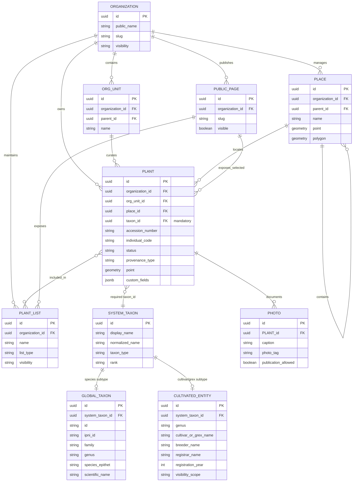

# System Model

## Domain Model

### Scientific Taxonomy

Plant records are tied to a centralized taxonomic layer (not disclosed publicly).

The model supports families, genera, species, cultivars, grexes, global taxa, and tenant-owned local cultivated entities.

## Data Model

### High-Level Data Model



### Key Model Idea

The central entity of the system is **Plant**, a digital twin of a specific plant in a living collection. This is not merely a reference row or an abstract species, but an accession record for a specific specimen: with inventory number, status, placement location, organization ownership, photos, lists, and public representation.

The mandatory attribute **`taxon_id`** is the core of the model. It links each plant instance to the unified root entity **SystemTaxon**. Thanks to this, all operational scenarios—tracking, import, search, lists, exchange, QR pages, reporting, and the public map—work not with an arbitrary text plant name, but with a stable taxon identifier.

**SystemTaxon** acts as the common root entity for two major taxonomic contours:

* **globalTaxon** — species-level taxa from an authoritative catalog.
* **CultivatedEntity** — cultivars and grexes that may be recognized global records from registrars, or local records created within a specific organization.

This approach lets the user select a plant from a unified taxon lookup without artificially separating species search from cultivar search. For the user it looks like a single plant reference; internally the system preserves the distinction between scientific species taxa, global cultivars, grexes, and organization-local cultivars.

The architectural value is that all collection data becomes comparable across organizations. The same `taxon_id` can be used in plant cards, collection lists, wishlists, exchange lists, public pages, and reports. This creates a foundation for network scenarios: the system can match which taxa one organization seeks and another is ready to transfer, without relying on unstable text names, synonyms, local variants, and typos.

In the portfolio the model is shown at a high level. Internal auxiliary entities, visibility mechanisms, access tables, cultivar globalization workflows, and implementation details are intentionally omitted.

## API Contracts

Endpoint names and attributes are intentionally altered for the public space.

### API Design Approach

The backend exposes a REST/JSON API for managing living plant collections in a multi-tenant SaaS environment. API contracts are organized around domain capabilities: plant inventory, taxonomy lookup, batch operations, import workflows, public pages, media access and exchange scenarios.

Security is enforced at several layers:

* JWT-based authentication through Spring Security.
* Method-level authorization for sensitive operations.
* Tenant isolation through organization/root tenant context.
* Data-level filtering by tenant ownership.
* Bean Validation for request DTOs.
* Controlled public DTOs for anonymous endpoints.
* Soft delete for recoverable destructive actions.
* Centralized error handling with standard HTTP statuses.

---

### 1. Search Plant Instances

#### Purpose

Retrieve a paginated list of plant instances available to the current user within the active organization context.

#### Contract

```http
GET /api/inventory/plants
```

### Query Parameters

```text
keyword          optional text search
organization     optional tenant/root context
unit             optional department or collection unit
list             optional list filter
recursive        optional flag for nested units
filter           optional faceted filters
page             pagination parameter
size             pagination parameter
sort             sorting parameter
```

#### Response

```json
{
  "items": [
    {
      "id": "uuid",
      "displayName": "string",
      "taxon": "summary",
      "inventoryCode": "string",
      "status": "string",
      "location": "summary",
      "visibility": "string"
    }
  ],
  "page": {
    "number": 0,
    "size": 25,
    "totalElements": 0
  }
}
```

#### Security Notes

* Requires authenticated user.
* Result set is restricted to the tenant context available to the current user.
* Query specifications apply tenant filtering before returning data.
* Filter expressions are parsed into allowlisted criteria rather than executed as raw dynamic queries.
* Pagination and sorting use framework-level pageable parameters.

---

### 2. Get Plant Instance Details

#### Purpose

Retrieve a single plant instance as a digital record of a real plant in a living collection.

#### Contract

```http
GET /api/inventory/plants/{plantId}
```

#### Response

```json
{
  "id": "uuid",
  "taxon": {
    "id": "uuid",
    "displayName": "string",
    "type": "species | cultivar | grex"
  },
  "inventory": {
    "accessionNumber": "string",
    "individualCode": "string",
    "status": "string"
  },
  "organization": "summary",
  "location": "summary",
  "photos": ["summary"],
  "customFields": {}
}
```

#### Security Notes

* Requires authenticated user.
* Access is checked against the plant’s tenant ownership and the user’s organization memberships.
* Internal fields are not exposed through public-facing contracts.
* Non-existing or inaccessible resources are returned through standard error responses.

---

### 3. Create Plant Instance

#### Purpose

Create a new plant instance in an organization’s living collection.

#### Contract

```http
POST /api/inventory/plants
```

#### Request

```json
{
  "taxonId": "uuid",
  "organizationUnitId": "uuid",
  "placeId": "uuid",
  "inventoryData": {},
  "status": "string",
  "customFields": {}
}
```

#### Response

```http
201 Created
```

```json
{
  "id": "uuid",
  "displayName": "string",
  "taxon": "summary",
  "inventoryCode": "string",
  "status": "string"
}
```

#### Security Notes

* Requires authenticated user.
* Requires administrative or editor-level access to the target organizational unit.
* Request body is validated before domain processing.
* `taxonId` is mandatory and must refer to an allowed species, cultivar or grex visible in the current tenant context.
* Creation is delegated to the service layer after authorization and validation.

---

### 4. Update Plant Instance

#### Purpose

Update an existing plant instance, including inventory metadata, taxon reference, status or organizational placement.

#### Contract

```http
PUT /api/inventory/plants/{plantId}
```

#### Request

```json
{
  "taxonId": "uuid",
  "organizationUnitId": "uuid",
  "placeId": "uuid",
  "inventoryData": {},
  "status": "string",
  "customFields": {}
}
```

#### Response

```json
{
  "id": "uuid",
  "displayName": "string",
  "taxon": "summary",
  "status": "string",
  "location": "summary"
}
```

#### Security Notes

* Requires authenticated user.
* Requires write access to the existing plant record.
* If the plant is moved to another organizational unit, access to both the current and target contexts must be validated.
* Invalid move attempts are rejected with an access error.
* Request validation is performed through typed request DTOs and Bean Validation.

---

### 5. Soft Delete Plant Instance

#### Purpose

Move a plant record to trash without physically deleting it from the database.

#### Contract

```http
DELETE /api/inventory/plants/{plantId}
```

#### Response

```http
204 No Content
```

#### Security Notes

* Requires authenticated user.
* Requires administrative access to the plant’s organizational context.
* Deletion is recoverable by default.
* Soft-deleted records are excluded from normal queries.
* Permanent deletion is restricted to elevated platform-level roles.

---

### 6. Batch Operations on Plant Instances

#### Purpose

Perform bulk actions on selected plant instances: move, update, clone, generate label data or mark labels as printed.

### Contracts

```http
POST /api/inventory/plants/batch/move
POST /api/inventory/plants/batch/update
POST /api/inventory/plants/batch/clone
POST /api/inventory/plants/batch/label-data
POST /api/inventory/plants/batch/mark-printed
```

#### Request

```json
{
  "plantIds": ["uuid"],
  "operationPayload": {}
}
```

#### Response

```json
{
  "successCount": 0,
  "failureCount": 0,
  "results": [
    {
      "id": "uuid",
      "status": "success | failed",
      "message": "string"
    }
  ]
}
```

#### Security Notes

* Requires authenticated user.
* Each affected plant must be checked against tenant ownership and user permissions.
* Batch operations should not bypass per-resource authorization.
* Partial success is supported for operations where some records may fail validation or authorization.
* Input collections are validated before processing.

---

### 7. Dictionary Lookup for Plant Forms

#### Purpose

Return controlled dictionary values used by plant forms, such as lifecycle states, growing conditions or acquisition forms.

#### Contract

```http
GET /api/inventory/dictionaries/{dictionaryType}
```

#### Response

```json
[
  {
    "id": "string",
    "code": "string",
    "label": "string"
  }
]
```

#### Security Notes

* Requires authenticated user for internal dictionaries.
* Dictionary responses contain only safe reference data.
* Values are controlled by the platform or tenant configuration, not arbitrary free text.

---

### 8. Taxon Lookup

#### Purpose

Provide a unified lookup over species, cultivars and grexes when creating or editing a plant instance.

#### Contract

```http
GET /api/taxonomy/search
```

#### Query Parameters

```text
query       search term
type        optional taxon type filter
page        pagination parameter
size        pagination parameter
```

#### Response

```json
{
  "items": [
    {
      "id": "uuid",
      "displayName": "string",
      "taxonType": "species | cultivar | grex",
      "source": "reference | global | local"
    }
  ]
}
```

#### Security Notes

* Global reference species are available across tenants.
* Global cultivated entities are available across tenants.
* Local cultivated entities are visible only to allowed tenant contexts.
* The API hides internal visibility mechanics and exposes only selectable taxon summaries.

---

### 9. Smart Import Workflow

#### Purpose

Import existing collection data from spreadsheets through a staged workflow.

#### Contracts

```http
POST /api/import/sessions
POST /api/import/sessions/{sessionId}/sheet
POST /api/import/sessions/{sessionId}/mapping
POST /api/import/sessions/{sessionId}/resolve
POST /api/import/sessions/{sessionId}/execute
GET  /api/import/sessions/{sessionId}/status
GET  /api/import/sessions/{sessionId}/error-report
```

#### Workflow

```text
Upload file
→ Select sheet
→ Map columns
→ Resolve values
→ Confirm uncertain matches
→ Execute import
→ Review results
```

#### Response Example

```json
{
  "sessionId": "uuid",
  "status": "uploaded | mapped | resolving | ready | executing | completed | failed",
  "progress": {
    "processedRows": 0,
    "totalRows": 0
  }
}
```

#### Security Notes

* Requires authenticated user.
* Requires tenant context and import permission.
* Uploaded files are stored outside the relational database.
* Import sessions are tenant-scoped.
* Ambiguous matches require user confirmation.
* Invalid rows are reported without blocking all valid rows.
* Background jobs are used for long-running import stages.

---

### 10. Public Plant Page

#### Purpose

Expose a safe public view of a plant record, commonly used as a QR label target.

#### Contract

```http
GET /api/public/plants/{publicSlug}
```

#### Response

```json
{
  "displayName": "string",
  "taxon": "public summary",
  "organization": "public summary",
  "photos": ["public media reference"],
  "publicDescription": "string"
}
```

#### Security Notes

* Does not require authentication.
* Returns only public DTOs.
* Excludes internal identifiers, tenant metadata, private notes, internal inventory fields and restricted photos.
* Requires public visibility settings on the owning organization and plant/list context.
* Media access uses short-lived signed URLs or equivalent controlled delivery.

---

### 11. Exchange Match Lookup

#### Purpose

Find potential exchange matches between one organization’s wishlist and other organizations’ shared exchange lists.

#### Contract

```http
GET /api/exchange/matches/{wishlistId}
```

#### Response

```json
{
  "wishlist": "summary",
  "matches": [
    {
      "taxon": "summary",
      "sourceOrganization": "public or shared summary",
      "availableMaterial": "summary",
      "visibility": "string"
    }
  ]
}
```

#### Security Notes

* Requires authenticated user.
* User must have access to the source wishlist.
* Candidate matches are limited to data explicitly shared for exchange or visible to the relevant community scope.
* Matching is based on taxon identifiers rather than raw text names.
* Private collection data is not disclosed through the exchange API.

---

### Error Handling Pattern

```json
{
  "status": 400,
  "code": "VALIDATION_ERROR",
  "message": "Request validation failed",
  "details": []
}
```

Typical response statuses:

```text
200 OK                  successful read or update
201 Created             resource created
204 No Content          successful deletion
400 Bad Request         invalid input or domain validation failure
403 Forbidden           authenticated but not allowed
404 Not Found           resource missing or not visible
409 Conflict            state conflict or resource in use
429 Too Many Requests   rate limit exceeded
```

---

### Security Summary

The API design combines framework-level and domain-level protection:

* Spring Security authenticates requests and establishes user context.
* JWT carries identity, while roles and memberships are resolved server-side.
* Method-level checks protect write and administrative actions.
* Tenant-scoped queries prevent cross-organization data leakage.
* DTO validation blocks malformed requests before business logic execution.
* Public endpoints use separate response models with restricted field sets.
* Soft delete protects against accidental data loss.
* Platform-level operations are separated from tenant-level workflows.
* Audit and login events provide traceability for sensitive actions.
