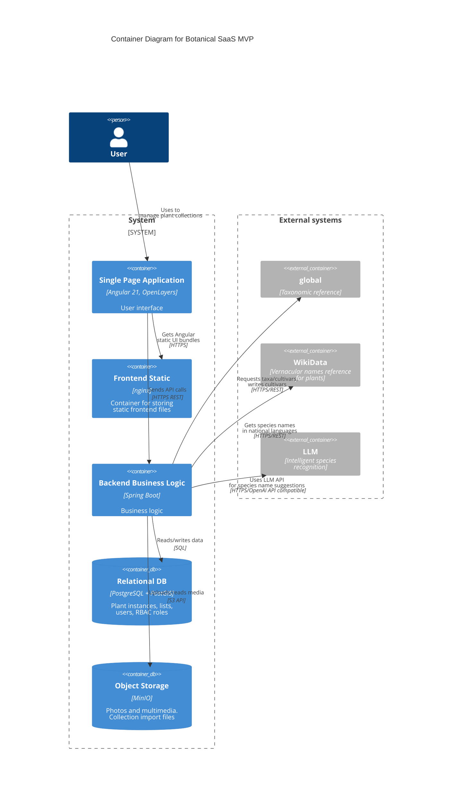

# Architecture and Integrations

## Architecture

### Container diagram (C4 Container)

## Integration Flows

### Taxonomy catalog import

The system includes a manual mechanism for updating the internal taxon reference from an XLS export while preserving identifiers.

### National taxon name enrichment

The system includes an automatic mechanism for enriching the internal vernacular plant names reference from open sources, subject to public API constraints.

### Smart Import

The platform includes an XLS import wizard for migrating existing plant collections into the system.

The flow supports file upload, sheet selection, column mapping (including with AI assistance), value resolution, fuzzy matching, asynchronous processing, row-level results, and error report export.

For mapping column names to system entity attributes, and for more accurate recognition of species, cultivar, or enum values, LLM integration and a lightweight harness are provided. Recognition confirmation (when it was not 100%) is performed by the user.
