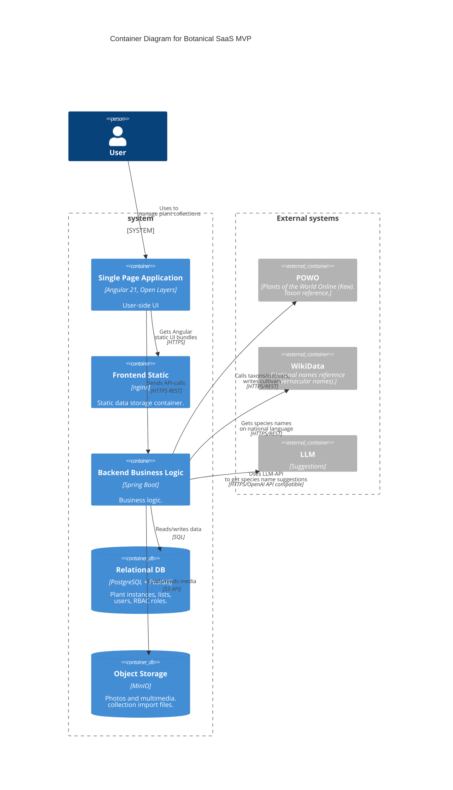

# Architecture and Integrations

## Architecture

### Container diagram

## Integration Flows

### Smart Import

The platform includes a guided spreadsheet import pipeline for existing plant collections.

The import flow supports file upload, sheet selection, column mapping, value resolution, fuzzy matching, asynchronous processing, row-level results, and error report export.
