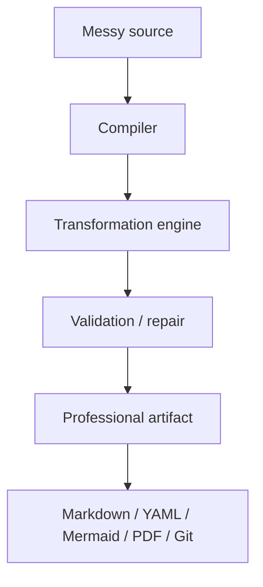

# Overview

DocCompile is a professional artifact compilation platform in progress. It started as a docs-as-code publisher and is evolving toward a processing layer that compiles messy source material into professional artifacts.

The original product formula:

```text
Markdown
+ Mermaid
+ architecture icons
+ images
+ professional themes
→ PDF
```

The current product formula:

> Source in. Contract satisfied. Artifact out.

The longer formulation: compile messy source material into professional artifacts that satisfy explicit contracts, remain grounded in evidence, and stay consistent across every output.

DocCompile should not compete for the place where documents live. It should compete for the moment where messy source material becomes a correct professional artifact.

## Product evolution

1. **Docs-as-code publisher.** Portable Markdown, diagrams-as-code, professional themes, and PDF export, rendered locally in the browser.
2. **SaaS contour.** Authentication, admin control plane, credits, billing, and server-side AI transformations on AWS.
3. **Strategic pivot.** Deprioritize proprietary cloud workspace / document storage. Own the transformation, not the document.
4. **Target Compiler platform.** A Compiler is a transformation contract. A universal Harness executes that contract without per-artifact hardcoded orchestration.

## Implemented vs target

### Implemented

The working system includes a local-first Markdown renderer with Mermaid, architecture icons, themes, images, print layout, and PDF export; an AWS-deployed SPA and serverless backend; Cognito identity and an admin control plane; runtime / versioned prompts; credit-metered AI transformations; and a commercial contour around Paddle.

Working AI transformations currently exist for at least ADR, requirements (FR/NFR, business rules, constraints), and Resume / CV. The exact Compiler list, publication lifecycle, and billing mode (Live vs sandbox) should be confirmed against the product repository.

### Target / planned

The next architecture is a universal Transformation Harness driven by Artifact Contracts, evidence / canonical facts, customizable output templates, Situations (multi-artifact packs), and later Patch Compile. These are not presented here as deployed behavior.

## Conceptual flow



Validation, repair, Git-native sinks, and contract-driven compilation are the target Harness path. The implemented path today is local rendering plus per-transformation AI jobs.

## Main actors

| Actor | Role |
|---|---|
| Author / professional user | Writes or pastes Markdown locally; exports PDF; optionally requests an AI compilation |
| Admin / Super Admin | Runtime configuration, prompt versions, transformation observability, Compiler publication |
| Compiler | Transformation contract for one class of professional artifact |
| Harness | Target generic orchestration that executes a Compiler contract |
| LLM provider | Replaceable model implementation, not the product moat |

## Major capabilities

| Capability | Status |
|---|---|
| GFM / Markdown rendering | Implemented |
| Mermaid and architecture icons | Implemented |
| Professional themes, print layout, PDF | Implemented |
| Local-first rendering; content stays in the browser by default | Implemented |
| Cognito authentication and RBAC | Implemented |
| Runtime / versioned prompts | Implemented |
| Credit-metered AI transformations | Implemented |
| Paddle billing contour | Implemented; Live vs sandbox to be confirmed |
| Transformation history / admin observability | Implemented; depth to be confirmed |
| Universal Harness / Artifact Contract | Target |
| Evidence / Canonical Fact Model | Target |
| Situations and Patch Compile | Target |

## Technology stack

| Layer | Choice | Role |
|---|---|---|
| UI | Client-side SPA | Local rendering, editor, export |
| Delivery | CloudFront + private S3 origin / OAC | Static frontend |
| API | API Gateway + Lambda | Authenticated server-side operations |
| State | DynamoDB | Jobs, credits, runtime config, prompts |
| Identity | Amazon Cognito | Registration, authentication, roles |
| Infra | Terraform | Reproducible AWS environment |
| CI/CD | GitHub Actions + OIDC | Deploy without long-lived cloud credentials |
| Intelligence | External LLM API | Replaceable generation component |
| Billing | Paddle | Merchant-of-Record payments |

SQS, WebSocket result notification, Step Functions, and ECS Fargate appear in the architecture direction; only currently deployed services should be treated as implemented.
