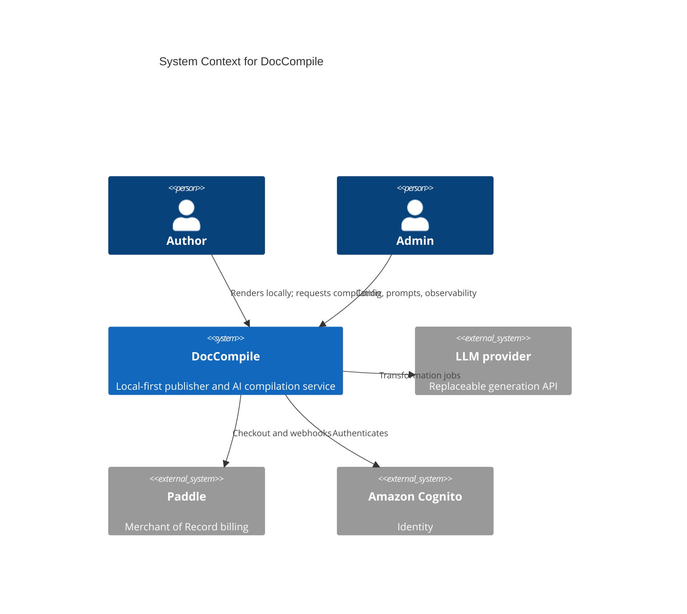
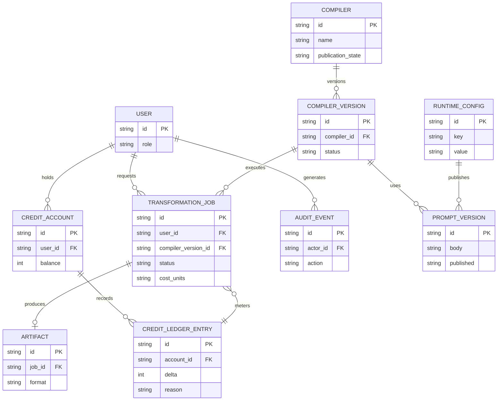

# System Model

## Domain Model

The implemented domain is a local-first publisher plus a serverless AI transformation contour. Future Compiler / Harness concepts are listed separately and are not part of the current data model.

### Implemented concepts

| Concept | Meaning |
|---|---|
| User | Authenticated identity from Cognito |
| Role | USER, ADMIN, SUPER_ADMIN |
| Compiler | Named transformation type (historically "Template") for a class of artifact |
| Compiler version | Runnable revision of a Compiler / prompt configuration |
| Output template | Presentation structure for an artifact; currently less separated from Compiler logic than the target model |
| Compile run / transformation job | Asynchronous server-side AI job with status, cost, and result handling |
| Artifact | Generated Markdown / document output of a run |
| Credit account | Per-user balance for compute-heavy operations |
| Credit ledger entry | Attributable debit / credit of usage |
| Runtime configuration | Server-side settings that can change without redeploy |
| Prompt definition / prompt version | Versioned AI behavior with publish / rollback |
| Audit event | Trace of sensitive admin and transformation actions |

Exact table names and attributes are omitted in the public pack.

### Target / planned concepts

These must not be read as implemented entities:

| Concept | Meaning |
|---|---|
| Artifact Contract | Objective success definition for a Compiler: parse, schema, evidence, layout constraints |
| Fact | Canonical extracted claim with status (asserted / uncertain / conflicting / unknown) |
| Evidence | Provenance pointer from a Fact back to source material |
| Situation | Orchestration of several Compilers around one user goal |
| Artifact pack | Set of related artifacts that must stay consistent |
| Patch Compile | Brownfield update of an existing artifact instead of full regeneration |

## Context diagram



## Data Model

### High-level implemented model



`publication_state` (PUBLIC / INTERNAL / DISABLED) is a target Compiler lifecycle. If the product repository does not yet persist it, treat it as planned.

### Target fact model (not implemented)

```text
Fact
├── id
├── concept
├── value
├── status: asserted | uncertain | conflicting | unknown
├── evidence[]
├── source
└── provenance
```

Example domain facts (planned): RequirementFact, BusinessRuleFact, ConstraintFact, NfrFact, EndpointFact, EmploymentFact, SkillFact.

## Key model idea

The implemented center of gravity is the **transformation job**: an explicit, metered, asynchronous compilation request. Local documents are not the system's source of truth in the cloud; they remain with the user until a job is requested.

The target center of gravity is the **Compiler contract**: input contract, fact schema, artifact contract, validators, repair strategies, and quality metrics. Adding a Compiler should not require changing Harness orchestration.

## Compiler concept

A Compiler is not merely a Markdown skeleton. It is a transformation contract for a specific class of professional artifact:

```text
Compiler
├── Input Contract
├── Fact Schema
├── Artifact Contract
├── Evidence / Grounding Rules
├── Output Template
├── Validators
├── Repair Strategies
├── Presentation Constraints
└── Quality Metrics
```

Architectural principle (target):

```text
Artifact Contract
=
Compiler Invariants
+ Output Template
+ User Options
+ Organization Rules
```

A custom template may change artifact structure but must not weaken Compiler guarantees.

Examples of current / planned Compilers: ADR; Requirements Specification; Resume / CV; API Contract; System Design; Meeting Summary; Proposal; Executive Summary. Only the first group is claimed as working transformations today.

## API contracts

Endpoint names in the public pack are illustrative. The backend exposes a REST/JSON API for identity-gated SaaS operations. Local rendering does not go through this API.

Capability groups:

* authentication against Cognito;
* transformation job submit / status / result;
* credit balance and ledger;
* admin runtime configuration and prompt versions;
* billing webhooks from Paddle.

Security layers:

* JWT from Cognito on authenticated routes;
* role checks for ADMIN / SUPER_ADMIN operations;
* secrets and provider keys stay server-side;
* webhook routes verify Paddle signatures;
* job results are restricted to the owning user except for admin observability.

### Transformation job lifecycle (implemented direction)

```text
submit
-> queued / running
-> succeeded | failed
-> result available to owner
```

Status names may differ in code. The invariant is: a job is attributable, metered, and inspectable; it is not a free-form chat session.

### Error handling pattern

Typical statuses:

```text
200 OK                  successful read
202 Accepted            job accepted
400 Bad Request         invalid input
401 Unauthorized        missing or invalid identity
403 Forbidden           authenticated but not allowed
404 Not Found           resource missing or not visible
409 Conflict            state conflict
429 Too Many Requests   rate or credit limit
```
