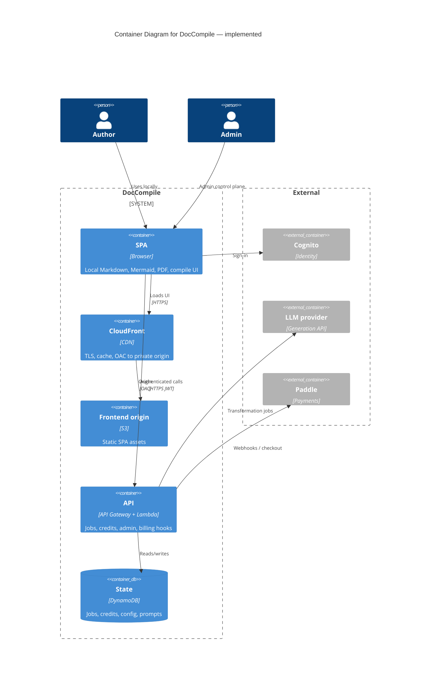
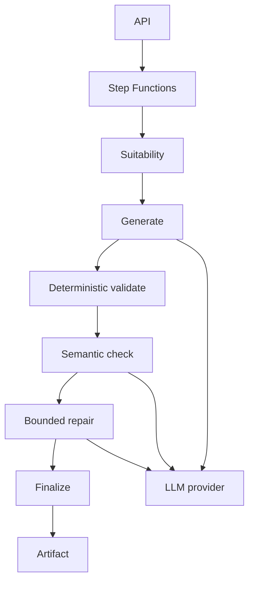

# Architecture and Integrations

## Current Architecture

The implemented system is a client-side SPA with a serverless AWS backend for identity, billing, configuration, and AI jobs.

```text
Browser SPA
    → CloudFront
    → private S3 origin (OAC)

Authenticated / server-side operations:
Browser
    → API Gateway
    → Lambda
    → DynamoDB / SQS / external services
```

Large document bodies are not the default backend payload. Local rendering, Mermaid, themes, assets, and PDF operations run in the browser. Content is sent to the server when the user explicitly starts an AI transformation.

AI processing uses an asynchronous job model around server-side workers and an external LLM provider. Exact use of SQS, WebSocket notifications, and polling should be confirmed against the product repository. Do not read Step Functions or ECS Fargate as currently deployed unless present in that repository.

```mermaid
architecture-beta
    service front(aws:cloudfront)[CloudFront]
    service static(aws:simple-storage-service)[Private S3 origin]
    service api(aws:api-gateway)[API Gateway]
    service lambda(aws:lambda)[Lambda]
    service dynamo(aws:dynamodb)[DynamoDB]
    service cognito(aws:cognito)[Cognito]
    service browser(logos:chrome)[Browser]
    service llm(logos:openai)[LLM provider]
    service paddle(logos:webhooks)[Paddle]

    browser:T --> B:front
    front:T --> B:static
    browser:R --> L:cognito
    browser:B --> T:api
    api:R --> L:lambda
    lambda:R --> L:dynamo
    lambda:B --> T:llm
    lambda:T --> B:paddle
```





Infrastructure is Terraform-managed. Deploys go through GitHub Actions using OIDC rather than long-lived cloud credentials.

### Integration flows

**Local publish.** The browser loads the SPA from CloudFront, renders Markdown / Mermaid locally, and exports PDF locally. No document upload.

**Authenticated compile.** The user signs in through Cognito, submits a transformation job through API Gateway, spends credits, and receives a result when the worker finishes. The LLM provider is an implementation detail behind that job.

**Billing.** Checkout and subscription / credit purchase go through Paddle. The backend trusts verified webhooks, not the browser, for paid entitlements.

**Admin.** Elevated roles change runtime configuration and prompt versions, inspect transformation history, and roll back published prompt configuration.

## Target / Planned Architecture

The central future differentiator is a universal Transformation Harness. It must not contain hardcoded branches such as `if Resume` / `if ADR` / `if Requirements`. It executes the contract supplied by the Compiler.

```text
Source
  ↓
Suitability
  ↓
Fact / Evidence Extraction
  ↓
Generation
  ↓
Deterministic Validation
  ↓
Semantic Checking
  ↓
Repair
  ↓
Final Validation
  ↓
Artifact
```

Orchestration direction:

```text
API
  ↓
Step Functions
  ↓
generic stages / workers
  ↓
external LLM provider
```



Harness capabilities (target): stage execution, model invocation, deterministic validators, semantic validators, structured violation reporting, bounded repair cycles, retry policies, provenance, token / cost accounting, execution tracing, safe cancellation boundaries.

Invariant: adding a new Compiler should not require changing core Harness orchestration.

### Future compute split

| Compute | When |
|---|---|
| Lambda | Lightweight / serverless stages |
| ECS Fargate | Heavy bounded workers (for example Chromium / deterministic publishing) when Lambda limits are insufficient |
| EC2 / GPU | Only if self-hosted inference or sustained workloads later justify it |

Principle: serverless orchestration first; specialized compute only when the workload justifies it. EC2 and containers are not part of the documented current architecture.
