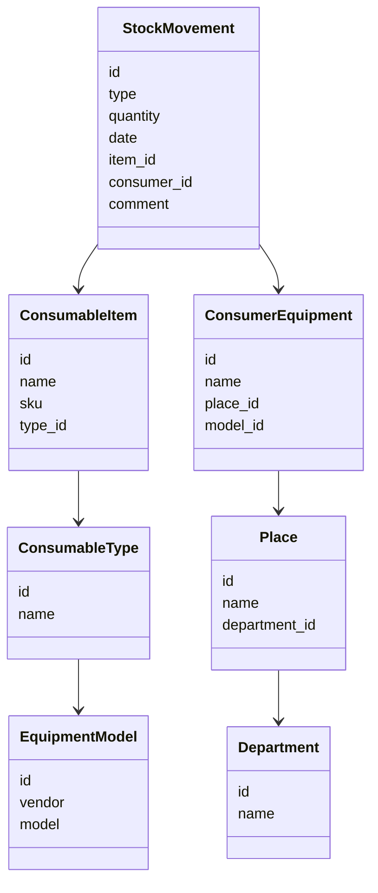

# Internal Consumables Accounting System

**Type:** Internal automation / early ERP-like inventory system
**Role:** initiator, concept author, prototype developer
**Status:** partial implementation / historical project
**Period:** early transition stage from infrastructure administration to internal systems development

## Context

The project emerged from a practical operational pain point within the IT department: consumables were purchased, issued, written off, and planned manually or through fragmented spreadsheets. The main accounting objects were printer cartridges and other IT consumables related to regular procurement, stock levels, issuance, replacement, and demand forecasting.

The idea was to create a lightweight internal ERP-like system for the IT department: not as a large corporate platform, but as an applied tool that would help track current stock levels, material movement history, and future procurement needs.

## Problem

Before this initiative, consumables accounting depended on manual discipline, local files, and employee memory. This created typical issues:

* it was difficult to quickly understand current stock levels;
* it was hard to reconstruct the history of receipts and issues;
* procurement was planned reactively rather than based on accumulated data;
* there was no unified structure for directories and operations;
* the data was useful for the department, but poorly formalized as a system.

## Project Goal

Create an internal tool for consumables accounting that would allow the IT department to:

* maintain a consumables directory;
* record receipts;
* account for issuance and write-offs;
* view current stock levels;
* analyze consumption dynamics;
* support procurement planning;
* reduce dependence on manual accounting and fragmented spreadsheets.

## Implementation

The project was started as an independent from-scratch development effort, but was not completed as a finished ERP system. However, the project is important not as a production-ready product, but as an early transition point from the role of a system administrator to the role of a person who designs and builds applied IT systems.

## Domain Model

The solution was based on a simple but practical domain model:

* consumable item;
* consumable type;
* equipment model;
* compatibility between consumables and equipment;
* stock balance;
* receipt;
* issue;
* write-off;
* department or place of use;
* movement history;
* planned demand;
* purchase request or procurement need.

## Architectural Approach

The project was conceived as a layered modular monolith: application logic, data model, simple user interface, and persistence layer were intended to be separated by responsibility, but without premature architectural complexity.

At the current maturity level, the project is more accurately described as an early internal automation prototype rather than a completed ERP system.

## What Was Partially Implemented

* Concept of an internal consumables accounting system.
* Basic structure of directories and operations.
* Approach to recording receipts and consumption.
* Spreadsheet-based model for practical accounting.
* Use of accumulated data for procurement planning.
* Transition from chaotic manual accounting to a more structured model.

## Technology Stack

* Spring Boot backend
* Thymeleaf-based simple UI
* Local deployment

## Class Diagram

## What This Project Demonstrates

ExpendIt demonstrates my early transition from an infrastructure-focused role to internal systems development and system analysis.

The project already contained elements that later became part of my professional profile:

* analysis of a real operational pain point;
* identification of domain entities;
* an attempt to build an accounting model;
* intention to replace a manual process with a structured system;
* practical automation for internal users;
* attention to data, operation history, and planning.

The project was not completed as a mature product, but it became an important step toward systems thinking, software development, and my later transition into systems analysis.
