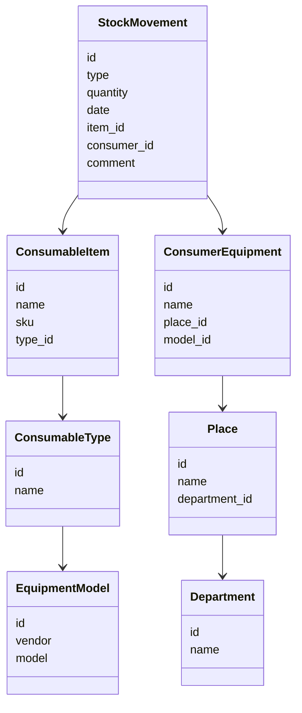

# System Model

## Domain Model

The solution was based on a simple but practical domain model:

* consumable item;
* consumable type;
* equipment model;
* compatibility between consumables and equipment;
* stock balance;
* receipt;
* issue;
* write-off;
* department or place of use;
* movement history;
* planned demand;
* purchase request or procurement need.

## Data Model

## Class Diagram

## API Contracts
