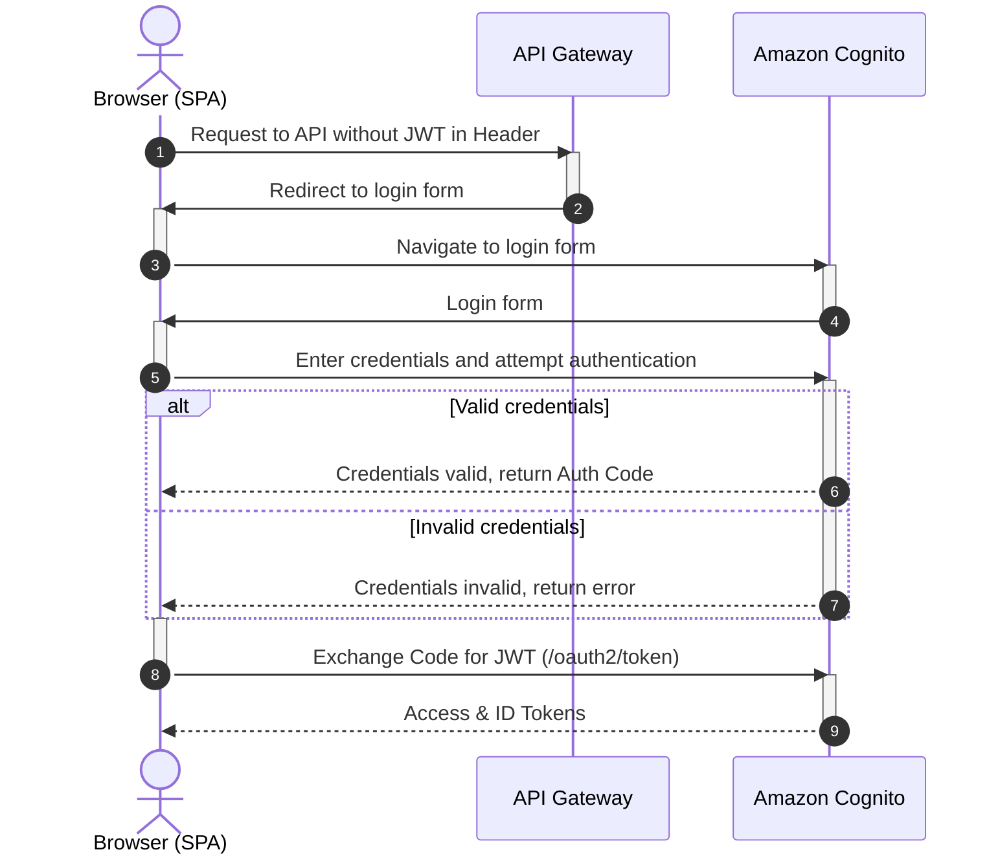
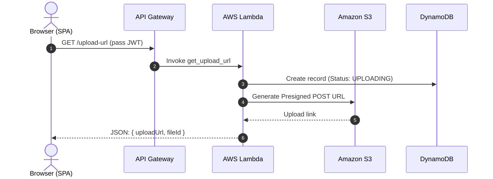
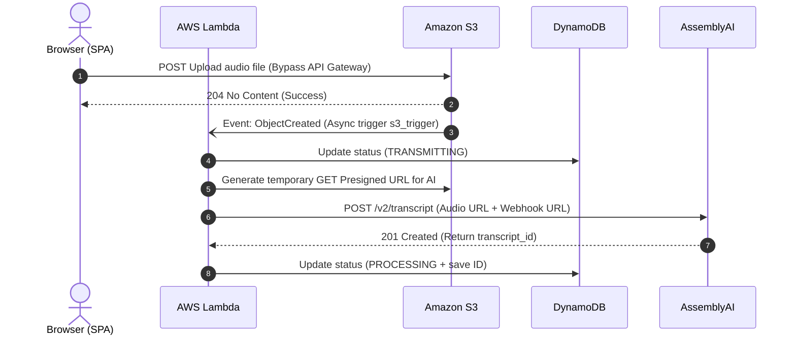
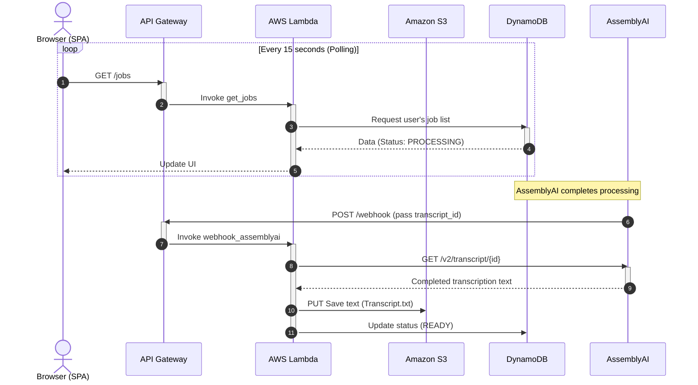
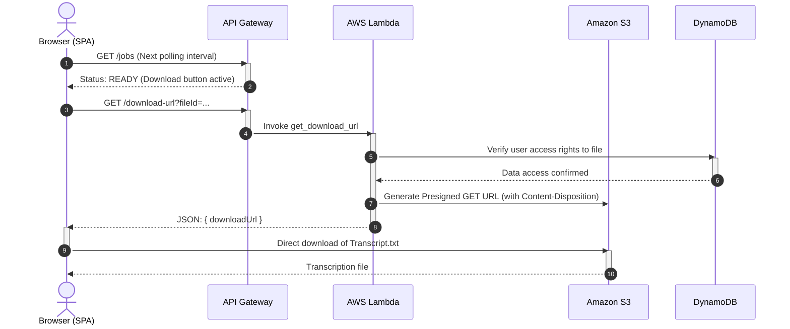

# Serverless Transcriber SaaS

**Status:** Active

## Product Overview
A serverless solution for transcribing audio recordings using an external transcription API.

## Background
There is an episodic need for fast and cost-effective transcription of large audio files (1.5h+) with minimal infrastructure costs. Low workload and a limited user base (up to 40 hours of recordings per month for 1-3 users).

## Requirements
* Accessible from any internet-connected device.
* Availability Region: European part of Eurasia (EU).
* Optimally minimal infrastructure usage.
* Audio file size: up to 300MB.
* Audio duration: up to 6 hours.
* Concurrent processing of up to 5 files.
* Strict access control to the service.
* Complete isolation of user data.

## UI Screenshots
### Main menu
<figure markdown>

<figcaption>Main menu</figcaption>
</figure>

### Upoading a record
<figure markdown>

<figcaption>Uploading a record</figcaption>
</figure>

### Processing the record
<figure markdown>

<figcaption>Processing the record</figcaption>
</figure>

## Architectural Challenges & Engineering Decisions
* **Optimal Resource Utilization:** Need to account for the episodic nature of resource usage, a small number of use cases, and broad regional availability.
  * *Solution:* Utilize a Serverless approach and AWS Lambda infrastructure. A traditional VPS is unsuitable due to recurring computing costs (even when the service is idle). A Telegram bot is not viable due to audio file size limits (and the bot's logic still requires hosting).
* **Handling 300MB Files:** Need to account for large file volumes and limitations of standard gateways (like API Gateway payload limits).
  * *Solution:* Utilize direct upload to Amazon S3 via Presigned URLs, bypassing API Gateway completely.
* **Optimal Transcription Infrastructure:** Need to account for a zero budget for GPU equipment and hosting open-source LLMs/Models.
  * *Solution:* Integrate a third-party transcription API. AssemblyAI was chosen for providing the best quality-to-price ratio on the market.
* **Robust Event-Driven Model:** Lambda is excellent for decoupling the solution, but the third-party API transcription time may exceed the Lambda execution timeout.
  * *Solution:* Decouple the audio file submission from the text result retrieval. The selected transcription provider supports webhook notifications.
* **User Data Isolation:** Ensure compliance with access restrictions and data separation requirements.
  * *Solution:* Use AWS Cognito. It provides built-in account management, user registration, 2FA, brute-force protection, etc. The service seamlessly integrates into the AWS ecosystem.

## Role and Responsibilities
In this project, I acted as the Solution Designer, DevOps Engineer, and QA Tester.
* Formalized business and non-functional requirements (NFRs).
* Formulated tasks for Claude Code (AI-assisted development).
* Designed the Target Architecture.
* Prepared Architecture Decision Records (ADRs) for tech stack selection during the pre-sale phase.

## Technology Stack
* **Backend:** Python on AWS Lambda
* **Data Layer:** Amazon S3 (audio and transcription files), AWS DynamoDB (job status tracking)
* **Frontend:** Static HTML + Vanilla JS hosted on Amazon S3 and distributed via AWS CloudFront
* **Security:** Amazon Cognito (PKCE flow)
* **Infrastructure & IaC:** AWS API Gateway, fully provisioned via Terraform

---
## Architecture artifacts
### Cloud Architecture Diagram 

```mermaid
architecture-beta
    service dynamo(aws:dynamodb)[AWS DynamoDB]
    service lambda(aws:lambda)[AWS Lambda] 
    service api(aws:api-gateway)[AWS API Gateway]
    service static(aws:simple-storage-service)[Static website at Amazon S3]
    service storage(aws:simple-storage-service)[File storage at Amazon S3]
    service browser(logos:chrome)[Browser]
    service cognito(aws:cognito)[AWS Cognito]
    service ai(logos:webhooks)[AssemblyAI API]
    service front(aws:cloudfront)[AWS CloudFront]

front:T -- B:static
    browser:T -- B:api
    browser:L -- R:front
    browser:B -- T:cognito

    api:R -- L:lambda
    api:T <-- B:ai
    lambda:T -- R:ai
    lambda:R -- L:dynamo
    lambda:B -- T:storage
    storage:L -- R:browser
```

### Sequence Diagrams
#### Authentication

#### Audio File Upload Initiation

#### Direct Upload & Asynchronous Trigger (Event-Driven)

#### AI Processing & Webhook (up to several minutes)

#### Result Retrieval (Download)
