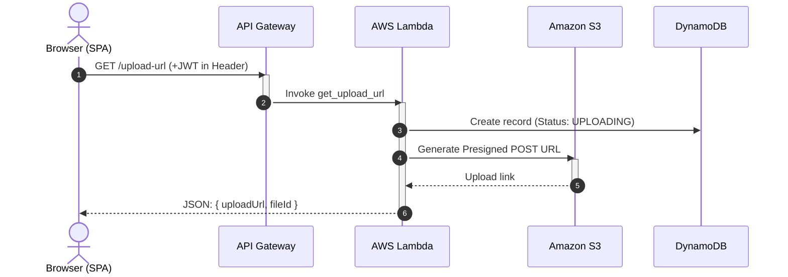
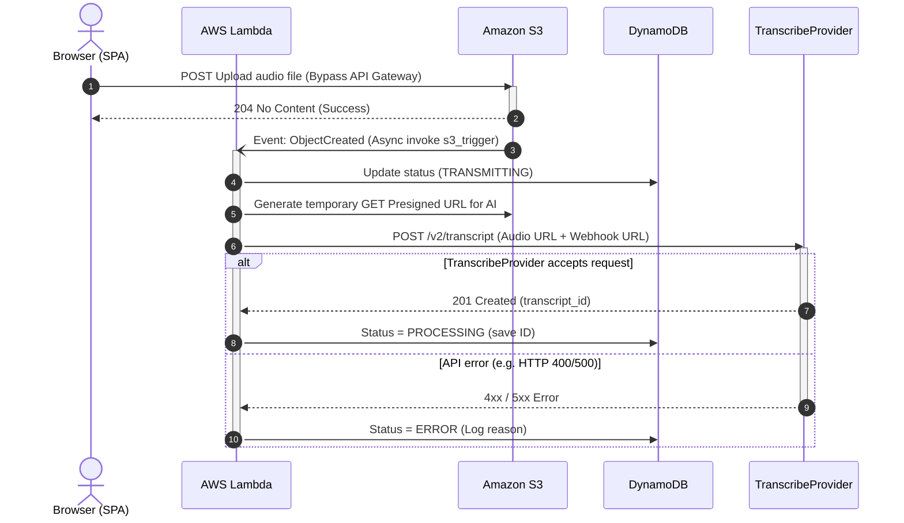
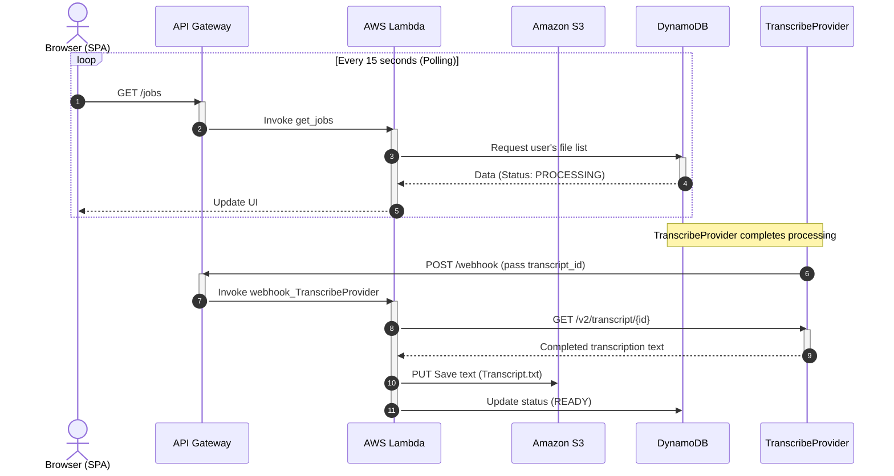
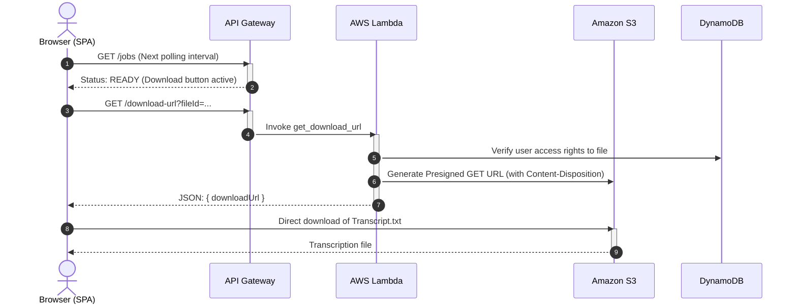

# Architecture and Integrations

## Architecture

## Architectural concept

The system is built on an event-driven model.

The static frontend is served via S3/CloudFront. The user authenticates through Cognito Hosted UI and calls API Gateway using the obtained JWT. API Gateway routes requests to Lambda functions.

Large audio files do not pass through API Gateway and Lambda. The backend issues a presigned POST URL, after which the browser uploads the file directly to S3. An S3 ObjectCreated event triggers a handler that creates a temporary URL for the transcription provider and submits a new transcription request. The external provider performs long transcription asynchronously and returns the result via webhook. The final text transcript is saved to S3, and the job status is updated and stored in DynamoDB.

```mermaid
architecture-beta
    service dynamo(aws:dynamodb)[AWS DynamoDB]
    service lambda(aws:lambda)[AWS Lambda] 
    service api(aws:api-gateway)[AWS API Gateway]
    service static(aws:simple-storage-service)[Static website at Amazon S3]
    service storage(aws:simple-storage-service)[File storage at Amazon S3]
    service browser(logos:chrome)[Browser]
    service cognito(aws:cognito)[AWS Cognito]
    service ai(logos:webhooks)[Transcriber API]
    service front(aws:cloudfront)[AWS CloudFront]

    front:T -- B:static
    browser:T -- B:api
    browser:L -- R:front
    browser:B -- T:cognito

    api:R -- L:lambda
    api:T <-- B:ai
    lambda:T -- R:ai
    lambda:R -- L:dynamo
    lambda:B -- T:storage
    storage:L -- R:browser
```

## Integration flows

## Sequence diagrams

### Audio file submission

### Direct upload and asynchronous trigger (event-driven)

### AI processing and webhook (up to several minutes)

### Result retrieval (download)

