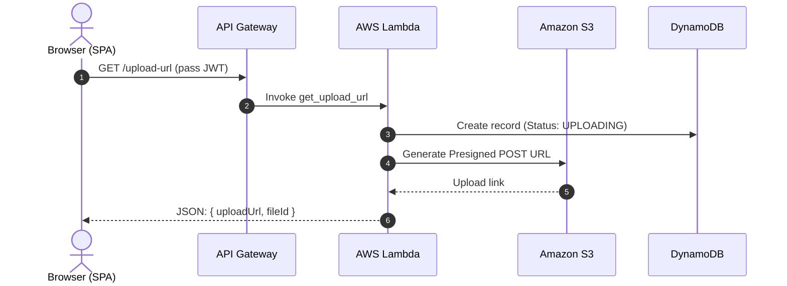
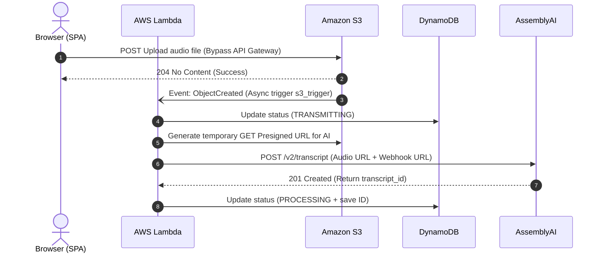
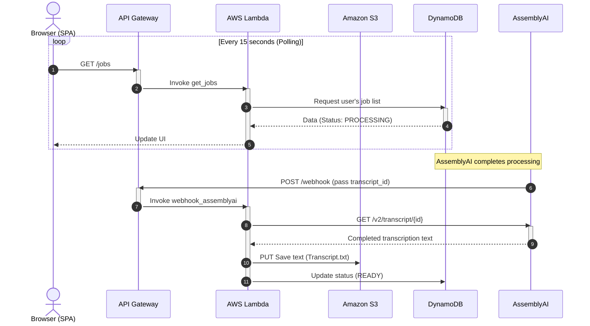
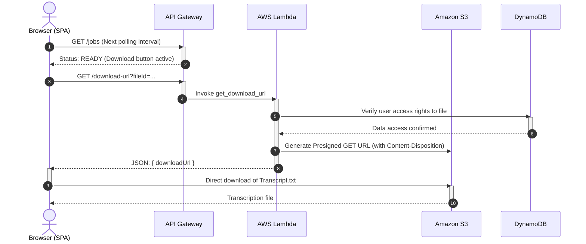

# Architecture and Integrations

## Architecture

## Cloud Architecture Diagram

## Integration Flows

## Sequence Diagrams

### Audio File Upload Initiation

### Direct Upload & Asynchronous Trigger (Event-Driven)

### AI Processing & Webhook (up to several minutes)

### Result Retrieval (Download)

