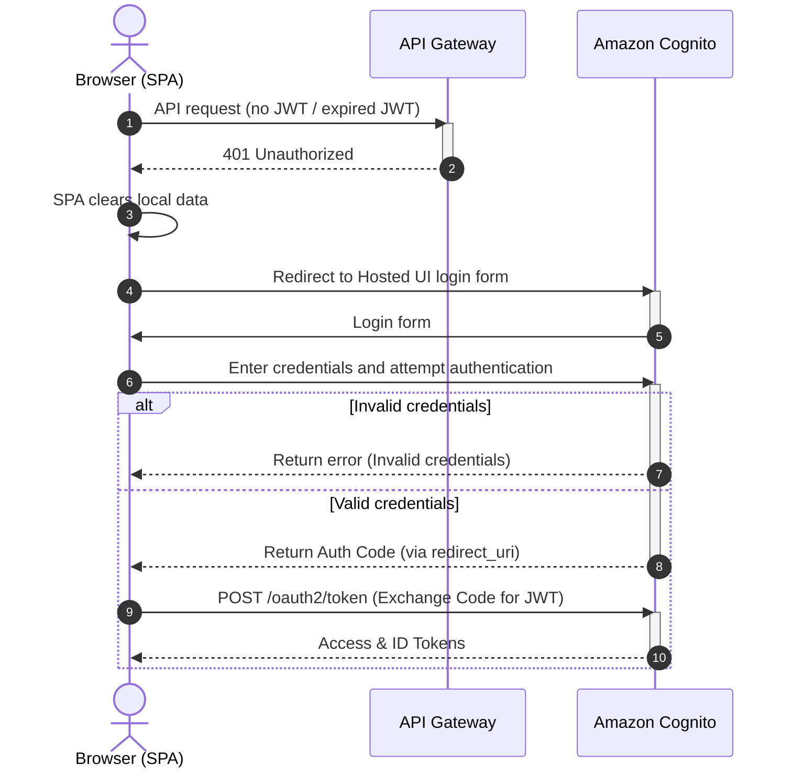

# Security, Quality, and Operations

## Security and access model

## Access requirements

- Access to the service must be restricted.
- User data must be isolated.

## Authentication — AWS Cognito

* **User data isolation:** AWS Cognito provides built-in account management, registration, 2FA, brute-force protection, etc. The service integrates seamlessly into the AWS ecosystem.
* Per-file access check on download (`get_download_url` verifies access in DynamoDB before issuing a Presigned URL).

### Authentication

## Failure modes

## Lambda timeout vs long-running transcription

A third-party API may take longer to transcribe than a single Lambda execution allows. Waiting synchronously for the result inside one function will cause a timeout.

**Mitigation:** temporal decoupling — the client uploads audio, Lambda submits the request to AssemblyAI with a webhook URL, a separate webhook handler receives the completed text on callback. The UI polls `GET /jobs` until status becomes `READY`.

## AssemblyAI API errors

When a request is rejected or fails (HTTP 4xx/5xx), the record is updated to `ERROR` and the reason is logged.

## Sizing and cost notes

* **Workload:** up to 40 hours of recordings per month.
* **Users:** 1–3 users.
* **Typical file profile:** large audio (1.5h+), up to 300 MB and 6 hours.
* **Concurrency:** up to 5 files simultaneously.
* **Economics:** serverless pay-per-use to minimize idle infrastructure costs for episodic usage.
