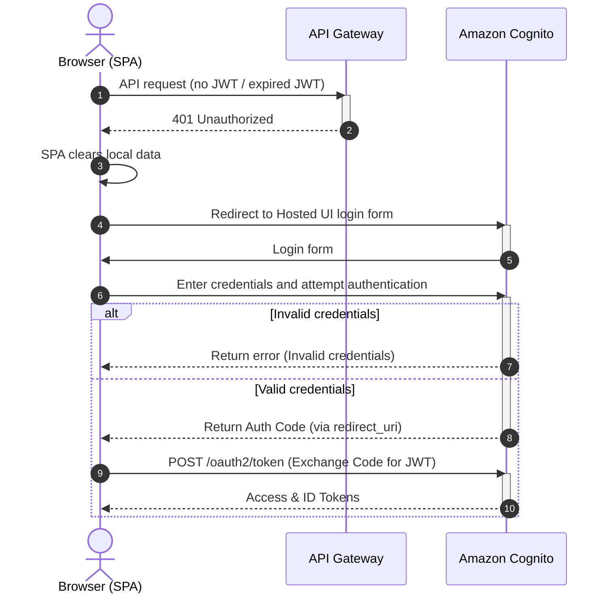

# Security, Quality, and Operations

## Security and access model

| Zone | Risk | Control |
|---|---|---|
| Authentication | unauthorized user access | Cognito Hosted UI, JWT validation |
| Authorization | downloading another user's transcript | owner check in DynamoDB before issuing presigned GET URL |
| Upload | uploading an oversized/unsupported file | client-side and backend-side validation, content-type/size constraints |
| S3 access | direct public access to files | private buckets, presigned URLs only |
| Webhook | forged callback | shared secret / provider verification |
| Secrets | provider API key leak | Secrets Manager / encrypted env, no secrets in code |
| Logs | private data in logs | do not log transcript/audio content, only status/error metadata |
| Cost abuse | mass launch of expensive jobs | user limits, quotas, AWS budget alerts |

## Access requirements

- Access to the service must be restricted.
- User data must be isolated.

## Authentication — AWS Cognito

* **User data isolation:** AWS Cognito provides built-in account management, registration, 2FA, brute-force protection, etc. The service integrates seamlessly into the AWS ecosystem.
* Per-file access check on download (`get_download_url` verifies access in DynamoDB before issuing a Presigned URL).

### Authentication

## Failure modes

| Failure mode | Impact | Detection | Mitigation / recovery |
|---|---|---|---|
| Lambda timeout during synchronous transcription | job does not complete | Lambda logs | async workflow + webhook |
| Provider API error 4xx/5xx | job moves to ERROR | provider logs | save reason, show status to user |
| Webhook not received | task stuck in PROCESSING | UI | retry via a new job |
| Repeated webhook | possible result overwrite | duplicate callback | idempotent write via transcriptId |
| User attempts to download another user's transcript | data leak | access check fails | owner verification before issuing presigned URL |
| Presigned URL expired | user cannot upload/download file | client error | generate a new presigned URL |
| S3 upload not completed | task remains in UPLOADING | stuck UPLOADING status | TTL cleanup / retry upload |
| API key leak | unauthorized spend | AWS quota notifications | key rotation, quota reset, transcription provider budget limit + overdraft disabled |
| Cost growth from mass jobs | unexpected bill | AWS Budgets / CloudWatch | quotas, concurrency limit, transcription provider budget limit + overdraft disabled |
| Transcript saved but status not updated | UI does not show ready result | UI does not show ready result | integrity check / debug job logic |

## Sizing and cost estimate

### Expected workload

| Parameter | Value |
|---|---:|
| Users | 1–3 |
| Audio per month | up to 40 hours |
| Average file length | 1.5+ hours |
| Maximum file length | 6 hours |
| Maximum file size | 300 MB |
| Concurrent jobs | up to 5 |

### Cost drivers

| Component | What affects cost |
|---|---|
| Transcription provider | audio minutes/hours |
| S3 | volume of audio and transcript files |
| DynamoDB | number of job/status reads |
| Lambda | number of invocations and handler duration |
| API Gateway | number of API requests |
| CloudFront/S3 static hosting | frontend traffic |
| Secrets Manager | provider API key storage |
| CloudWatch | logs retention |

### Cost logic

The main cost is not AWS compute but the external transcription provider. AWS Lambda, API Gateway, DynamoDB, and S3 remain secondary cost drivers at the given workload profile. Therefore the architecture is optimized not for high load but for minimal ongoing costs and no idle infrastructure.
