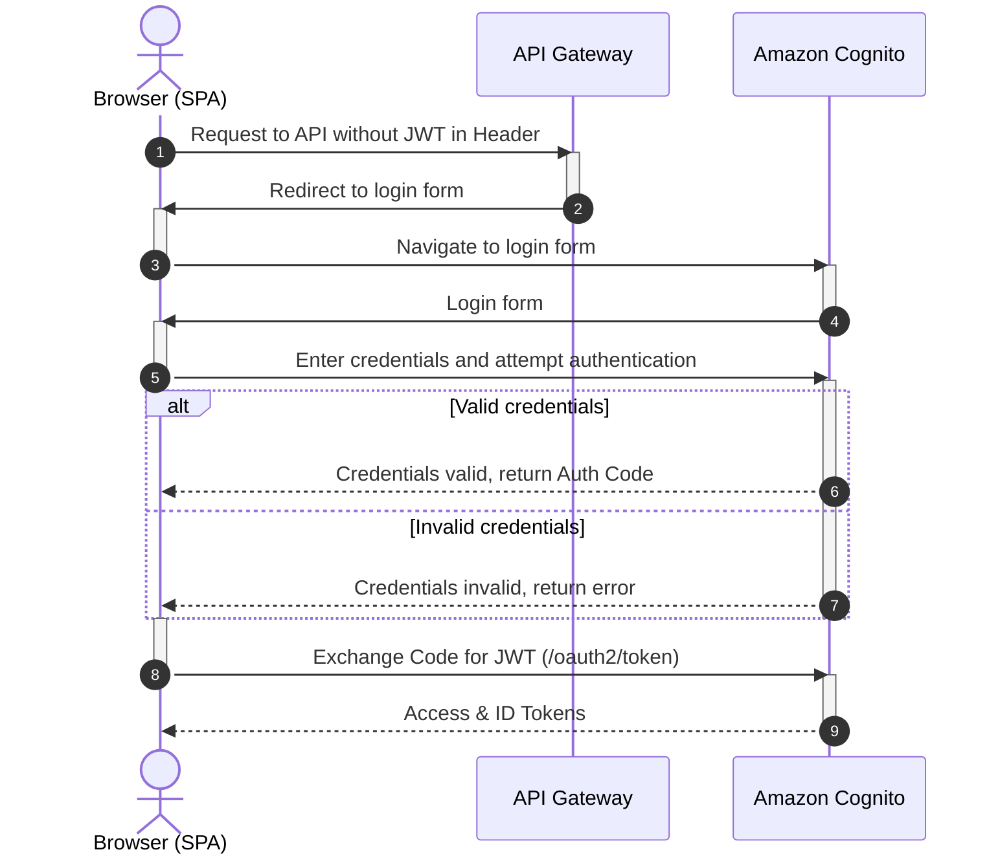

# Security, Quality, and Operations

## Security and Access Model

## Access requirements

* Strict access control to the service.
* Complete isolation of user data.

## Authentication - Amazon Cognito (PKCE)

* **User Data Isolation:** AWS Cognito provides built-in account management, user registration, 2FA, brute-force protection, etc. The service integrates into the AWS ecosystem.
* Per-job access checks on download (`get_download_url` verifies user rights in DynamoDB before issuing a Presigned URL).

### Authentication sequence

## Non-Functional Requirements

* Accessible from any internet-connected device.
* Concurrent processing of up to 5 files.
* Audio file size: up to 300MB.
* Audio duration: up to 6 hours.
* Optimally minimal infrastructure usage.

## Failure Modes

## Lambda execution timeout vs long-running transcription

Third-party transcription can run longer than a single Lambda invocation allows. Submitting audio and waiting synchronously for the transcript inside one Lambda would time out.

**Mitigation:** Decouple submission from result retrieval - the client uploads audio, Lambda submits to AssemblyAI with a webhook URL, and a separate webhook handler fetches the completed transcript when AssemblyAI calls back. The UI polls `GET /jobs` until status becomes `READY`.

## AssemblyAI API errors

If AssemblyAI rejects or fails a request (HTTP 4xx/5xx), the job record is updated to `ERROR` and the failure reason is logged.

## Sizing and Cost Notes

* **Workload:** up to 40 hours of recordings per month.
* **Users:** 1–3 users.
* **Typical file profile:** large audio files (1.5h+), up to 300MB and 6 hours duration.
* **Concurrency:** up to 5 files processed in parallel.
* **Cost posture:** serverless pay-per-use chosen to minimize idle infrastructure spend for episodic usage.
