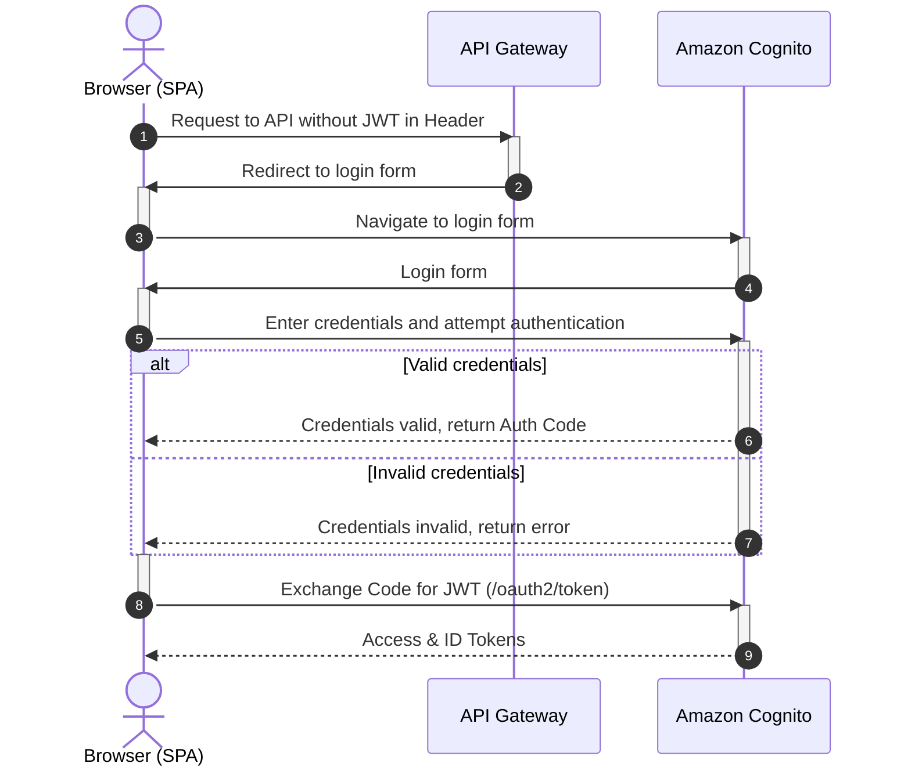

# Security and Access Model

## Access requirements

* Strict access control to the service.
* Complete isolation of user data.

## Authentication - Amazon Cognito (PKCE)

* **User Data Isolation:** AWS Cognito provides built-in account management, user registration, 2FA, brute-force protection, etc. The service integrates into the AWS ecosystem.
* Per-job access checks on download (`get_download_url` verifies user rights in DynamoDB before issuing a Presigned URL).

### Authentication sequence

