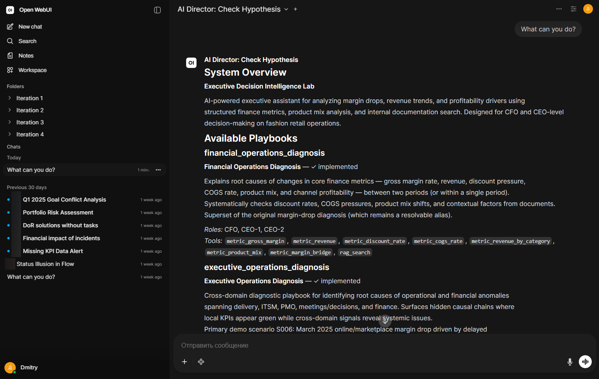
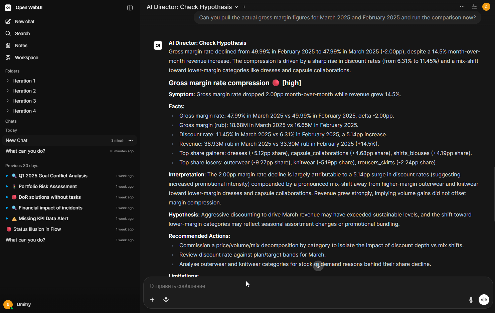
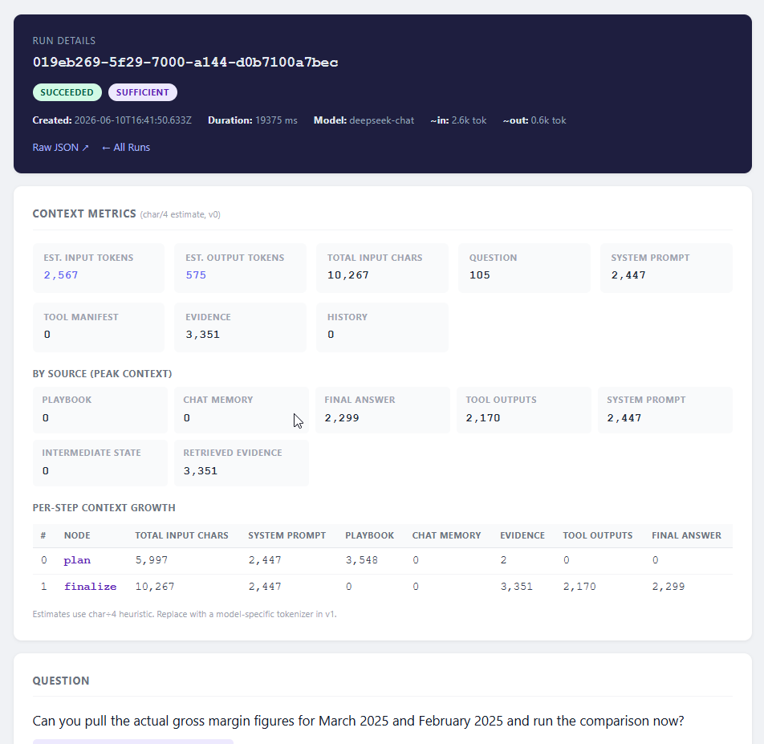
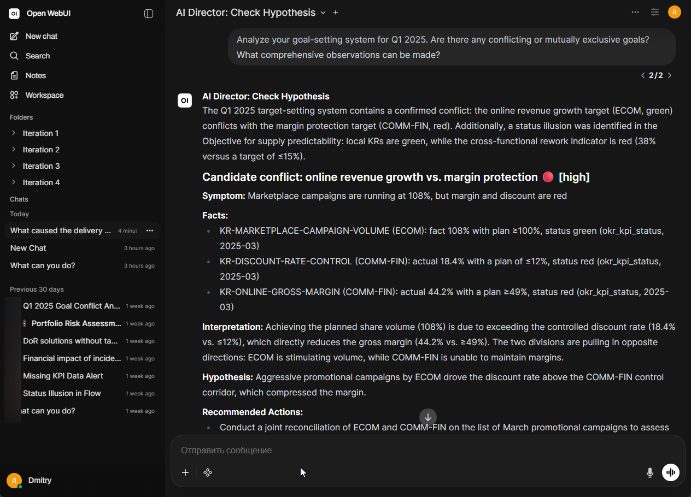

## Платформа Executive Decision Intelligence

**Тип:** Enterprise AI / система поддержки принятия решений / MVP агентной аналитики
**Роль:** Solution Architect, System Designer, AI-assisted Prototype Engineer
**Статус:** рабочий MVP-прототип, июнь 2026

### Контекст

Enterprise AI-прототип для управленческой аналитики, основанной на проверяемых данных.

Система построена вокруг простого принципа: LLM не “отвечает из памяти” и не получает прямой доступ к бизнес-данным. Вместо этого она работает внутри контролируемого контура исполнения: выбирает диагностический playbook, вызывает разрешённые backend tools, получает структурированные метрики и документальные evidence, сохраняет execution trace и формирует executive-level ответ, основанный на проверяемых данных.

Продуктовое направление — **AI Executive Analyst with verifiable evidence**: слой поддержки управленческих решений, который помогает руководителям и владельцам доменов исследовать бизнес-вопросы, выявлять операционные риски, объяснять отклонения и готовить управленческие действия без зависимости от непрозрачного AI-рассуждения.

### Проблема

Обычная управленческая аналитика требует ручной работы с BI-отчётами, таблицами, task trackers, протоколами встреч, документами и доменными экспертами. LLM может помочь с синтезом, но свободный чат поверх корпоративных данных небезопасен и ненадёжен: он может галлюцинировать, терять контекст, обращаться не к тому источнику данных или формировать выводы, которые невозможно проверить.

Этот проект исследует, как сделать LLM-based управленческую аналитику контролируемой, трассируемой и полезной для enterprise-среды.

### Зоны ответственности

* Спроектировал общую архитектуру MVP: chat harness, agent runtime, playbook routing, tool gateway, tool registry, слой структурированных данных, слой document RAG и execution trace.
* Построил лабораторный agent runtime на LangGraph/FastAPI для контролируемых диагностических workflows.
* Определил playbook-based подход: каждый бизнес-домен раскрывает ограниченный набор разрешённых tools, диагностических шагов, ограничений и ожидаемых evidence.
* Спроектировал controlled tool access model, при которой LLM никогда не обращается напрямую к PostgreSQL, Qdrant или MinIO.
* Реализовал и развил концепцию Tool Registry как machine-readable каталога доступных tools, схем, доменов, ограничений и разрешённых playbooks.
* Подготовил синтетические enterprise demo data для fashion/retail/manufacturing-компании, включая финансовые, delivery, ITSM, PMO, meeting, document и scenario-based anomalies.
* Разработал подход к evidence и прозрачности: selected playbook, tool calls, parameters, tool results, execution timeline, run details и JSON-level debug visibility.
* Настроил Open WebUI как временный chat-интерфейс для демонстрации MVP.
* Сформировал продуктовый вектор в сторону executive reports, signal cards, evidence graphs, proactive alerts и будущей backend-native orchestration.

### Ключевые архитектурные решения

* **Controlled LLM execution вместо free chat.**
  LLM рассуждает и планирует, но доступ к данным делегирован контролируемым backend tools.

* **Backend как control plane.**
  Backend определяет доступные tools, permissions, validation rules, execution boundaries, auditability и структуру ответа.

* **Tool Gateway pattern.**
  Весь доступ к данным проходит через controlled HTTP tools с явными input contracts, validation, structured output и metadata.

* **Playbook-based diagnostics.**
  Система маршрутизирует вопросы в доменные diagnostic playbooks вместо того, чтобы раскрывать LLM все tools сразу.

* **Evidence-first answers.**
  Финальные ответы должны опираться на tool outputs, document evidence, calculations или явно обозначенные limitations.

* **Run trace как слой доверия.**
  Каждый diagnostic run сохраняет selected playbook, tool calls, parameters, outputs и reasoning checkpoints для debugging и audit.

* **Lab runtime отделён от целевой архитектуры.**
  LangGraph и Open WebUI используются как быстрые MVP/lab tools. Целевая продуктовая архитектура предполагает backend-native control plane, dedicated UI, Tool Gateway, semantic layer, report service и audit trail.

### Реализованные возможности MVP

* Chat-based executive query interface через Open WebUI.
* LangGraph/FastAPI `agent-lab` runtime для diagnostic workflows.
* Tool-server layer для controlled backend tool execution.
* Концепция Tool Registry для tool discovery и playbook constraints.
* Financial Operations playbook для диагностики margin, revenue, discounts, COGS и product mix.
* Executive Operations / Delivery-oriented playbook для анализа roadmap, delivery, ITSM, PMO, meetings, tasks и KPI anomalies.
* Синтетический enterprise dataset со связанными бизнес-доменами.
* PostgreSQL-backed metric tools.
* Направление Qdrant/MinIO-backed document evidence для RAG.
* Playbook routing на основе user intent.
* Execution timeline и run details для прозрачности.
* Same-language response handling для user-facing answers.
* Начальные guardrails против wrong fallback behavior, repeated tool calls и unsupported analysis paths.

### Demo-сценарии

#### Финансовая функция

Пример вопроса:

> Почему в марте просела валовая маржа?

Система выбирает financial diagnostic playbook, вызывает metric tools для gross margin, revenue, discounts, COGS и product mix, затем формирует executive summary с evidence и limitations.

#### Операционная / проверка системы целеполагания

Пример вопроса:

> Почему time-to-market нестабилен, хотя локальные KPI команд выглядят нормально?

Система выбирает operational diagnostic playbook и исследует delivery, PMO, ITSM, meeting decisions и related evidence, чтобы выявить cross-functional bottlenecks, которые не видны в изолированных KPI dashboards.

#### Кросс-доменная проверка

Целевой сценарий:

> Выяви топ проблемных проектов, объясни критерии отбора, опиши проблему по каждому проекту и подготовь повестку встречи с product owners.

Этот сценарий демонстрирует целевое продуктовое направление: не просто извлечение просроченных задач, а превращение structured и document evidence в management-ready diagnostic brief.

## UI Скриншоты

### “Что ты умеешь?”

<figure markdown>

<figcaption>Доступные playbooks и tools</figcaption>
</figure>

### Финансовый плейбук: гипотеза о падении валовой маржи

<figure markdown>

<figcaption>Диагностика финансовых показателей: гипотеза падения маржи</figcaption>
</figure>

<figure markdown>

<figcaption>Диагностика финансовых показателей: отчет о расходе токенов (пока в символах)</figcaption>
</figure>

<figure markdown>

<figcaption>Диагностика финансовых показателей: ход размышлений и список вызванных инструментов</figcaption>
</figure>

### Операционный плейбук: аномалии системы целеполагания

<figure markdown>

<figcaption>Диагностика операционных аномалий на стыке delivery, ITSM, PMO и документов</figcaption>
</figure>

### Технологический стек

**Agent runtime:** LangGraph, FastAPI, Python
**Interface:** Open WebUI как временный demo harness
**Data layer:** PostgreSQL, Qdrant, MinIO, Redis
**AI integration:** OpenAI-compatible LLM API, prompt-based workflow control
**Architecture patterns:** Tool Gateway, Tool Registry, playbook-based diagnostics, RAG, semantic layer, run trace, evidence trail
**Development approach:** AI-assisted prototyping, synthetic data generation, scenario-driven MVP validation

### Что демонстрирует этот проект

Этот проект демонстрирует мою способность перейти от классического системного анализа к архитектуре enterprise AI-решений.

Он показывает, что я могу взять неоднозначную AI-продуктовую идею и превратить её в работающую, ограниченную и демонстрируемую систему: определить архитектуру, смоделировать данные, спроектировать diagnostic workflows, построить прототип, подготовить синтетические сценарии, раскрыть controlled tools и сделать LLM-ответы достаточно трассируемыми для enterprise-обсуждения.

Ключевая ценность - не "использование LLM для магии", а проектирование системы, в которой ИИ ограничен архитектурой, ограниченным набором инструментов и повышеной проверяемостью (auditability).
