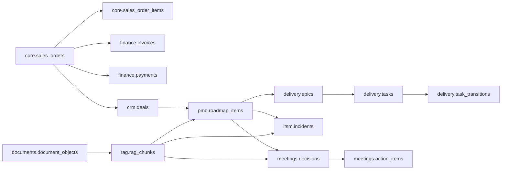

# Модель системы

## Доменная модель

### Основные участники:

| Сущность | Роль |
|---|---|
| Executive User | Задаёт управленческий вопрос и получает ответ |
| Domain Owner | Проверяет выводы по своему домену: finance, delivery, PMO, ITSM |
| Platform Admin | В целевой системе управляет источниками, доступами, плейбуками и инструментами |
| Playbook | Ограничивает диагностический процесс, доступные инструменты и доменную рамку |
| Tool | Контролируемая операция над данными: метрика, RAG, агрегированные данные |
| Diagnostic Run | Один запуск анализа с run_id, выбранным плейбуком, историей запусков инструментов и финальным ответом |
| Evidence Item | Факт, расчёт, документальный чанк или ограничение, связанное с выводом |
| Claim | Утверждение в ответе, которое должно ссылаться на диказательство |

### Синтетический датасет

В PoC используется синтетический датасет `fashion-v1`, концептуально расширенный в сторону `FashionCo Group / fashionco-enterprise`.

Домен компании:

- Премиум одежда / малое-среднее производство;
- B2B / B2B2C через дистрибьюторов, бутики, шоурумы и партнеров маркетплейсов;
- период данных: 2024-2025;
- бизнес-домены связаны в едином enterprise-контуре.

Основные домены данных:

| Домен | Содержание |
|---|---|
| `core` | customers, products, sales orders, order items |
| `crm` | companies, contacts, deals, activities, tasks |
| `finance` | invoices, payments, accounts receivable, COGS |
| `production` | production orders, operations, materials, supplier deliveries |
| `documents` | document objects, invoice files, metadata |
| `rag` | RAG documents and chunks |
| `delivery` | epics, tasks, transitions, rework, cycle time |
| `itsm` | incidents, SLA, affected services, business impact |
| `pmo` | roadmap items, milestones, slippage, status reports |
| `meetings` | decisions, action items, decision-to-action gaps |
| `goals` | KPI, objectives, ownership, conflicts — target/extension |
| `semantic` | metric definitions, business entities, calculation rules |
| `system` | dataset version, runtime metadata |
| `eval` | scenario truth, expected claims, forbidden claims — not exposed to normal tools |

## Модель данных

Упрощённая ERD-логика:



## API-контракты

### Agent endpoint

```http
POST /agent/check-hypothesis
Content-Type: application/json
```

Пример запроса:

```json
{
  "question": "Почему в марте 2025 просела валовая маржа?",
  "hypothesis": "Падение маржи связано со скидками",
  "context": {
    "period": "2025-03",
    "domain": "finance"
  }
}
```

Пример ответа:

```json
{
  "selected_playbook": "financial_operations",
  "verdict": "partially_supported",
  "final_answer": "...",
  "evidence": [
    {
      "type": "metric",
      "tool_id": "metric_gross_margin",
      "period": "2025-03",
      "summary": "gross margin decreased compared with baseline"
    }
  ],
  "tool_calls": [
    {
      "tool_id": "metric_gross_margin",
      "args": { "period": "2025-03" },
      "status": "ok"
    }
  ],
  "limitations": [
    "Analysis is based on synthetic dataset only"
  ]
}
```

### Tool-server health

```http
GET /health
```

Назначение: проверка доступности tool-server.

### Gross margin tool

```http
POST /tools/metric/gross-margin
Content-Type: application/json
```

Поддерживаемые формы запроса:

```json
{ "period": "2025-03" }
```

```json
{ "start_date": "2025-02-01", "end_date": "2025-03-31", "group_by": ["month"] }
```

Логика расчёта:

```text
revenue = SUM(core.sales_orders.net_amount_rub)
cogs = SUM(core.sales_orders.cogs_amount_rub)
gross_margin = revenue - cogs
gross_margin_rate = gross_margin / revenue
```

### RAG search tool

```http
POST /tools/rag-search
Content-Type: application/json
```

Пример запроса:

```json
{
  "query": "решение по Definition of Ready для промо-функции",
  "filters": {
    "domain": "delivery",
    "source_type": "meeting_minutes",
    "period": "2025-Q1"
  }
}
```

Ожидаемый ответ:

```json
{
  "status": "ok",
  "results": [
    {
      "document_id": "DOC-PMO-2025-03-12",
      "chunk_id": "CHUNK-001",
      "title": "PMO weekly meeting notes",
      "score": 0.82,
      "object_key": "executive-demo-docs/pmo/2025-03-12.md",
      "snippet": "..."
    }
  ]
}
```
