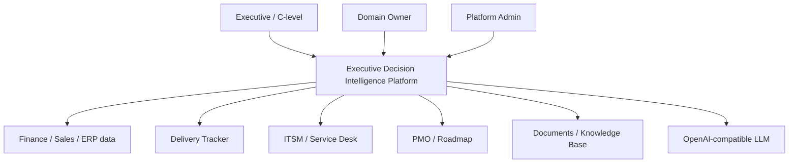
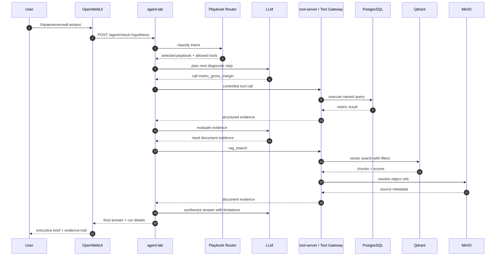

# Архитектура и интеграции
## Архитектурная концепция

```text
OpenWebUI
  → agent-lab / LangGraph
  → Playbook Router
  → selected playbook
  → Tool Registry
  → Tool Gateway / tool-server
  → PostgreSQL / Qdrant / MinIO
  → evidence
  → structured executive answer
```

## Context diagram



## Поток одного diagnostic run



## Интеграционные принципы

1. LLM не исполняет SQL.
2. LLM не читает документы напрямую.
3. LLM не получает полный список всех tools без ограничений.
4. Backend / tool-server валидирует входные параметры.
5. Tools возвращают structured JSON, metadata, warnings и status.
6. Evidence связывается с tool call, документом, period/entity и claim.
7. Debug visibility доступна через run details, но не должна раскрывать приватные chain-of-thought рассуждения.
