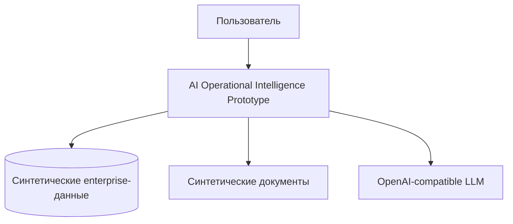
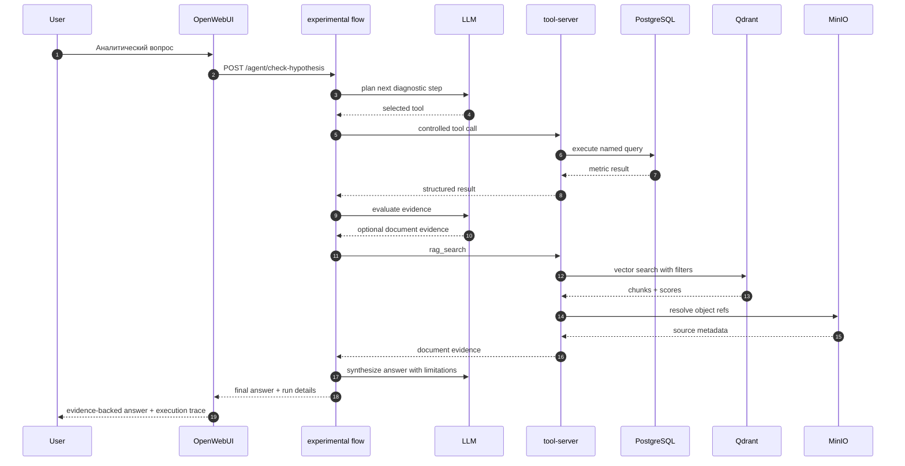

# Архитектура и интеграции

## Архитектурная идея

Архитектура описывает flow прототипа, а не завершённую продуктовую архитектуру.

```text
Пользовательский запрос
→ управляемый execution flow
→ выбор tool
→ вызов backend tool
→ структурированный результат
→ evidence-backed answer
→ execution trace
```

LLM должна действовать внутри контролируемой backend-mediated tool environment, а не как свободный чат-бот с прямым произвольным доступом к данным.

```text
OpenWebUI
  → экспериментальный LangGraph / FastAPI flow
  → выбор tool / прототипный playbook routing
  → концепт Tool Registry
  → tool-server / Tool Gateway
  → PostgreSQL / Qdrant / MinIO
  → структурированный результат
  → evidence-backed answer
  → execution trace
```

Это single-request цикл прототипа. Второе сообщение пользователя в Open WebUI не обрабатывалось как продолжение той же аналитической сессии.

## Context diagram


```mermaid
flowchart TB
    User[Пользователь]
    Prototype[AI Operational Intelligence Prototype]
    Synth[(Синтетические enterprise-данные)]
    Docs[Синтетические документы]
    LLM[OpenAI-compatible LLM]

    User --> Prototype
    Prototype --> Synth
    Prototype --> Docs
    Prototype --> LLM
```

Диаграмма показывает лабораторный стенд. Реальные коннекторы к ERP, ITSM, PMO или документным системам не реализованы.

## Паттерн Tool Gateway

Весь доступ к данным идёт через контролируемые HTTP tools с явными input contracts, валидацией, структурированным выводом и metadata.

## Прототипный концепт playbooks

Прототип исследовал маршрутизацию вопросов в доменные диагностические пути вместо раскрытия LLM всего каталога инструментов сразу.

Каждый домен предполагал ограниченный набор allowed tools, диагностических шагов, ограничений и ожидаемых evidence. Это экспериментальный концепт routing, а не полноценный playbook engine.

## Tool Registry

Реализован и развивался начальный концепт Tool Registry / описания инструментов как машиночитаемый каталог доступных tools, схем, доменов и ограничений.

## Один diagnostic run


```mermaid
sequenceDiagram
    autonumber
    participant U as User
    participant UI as OpenWebUI
    participant AG as experimental flow
    participant LLM as LLM
    participant TG as tool-server
    participant PG as PostgreSQL
    participant QD as Qdrant
    participant MN as MinIO

    U->>UI: Аналитический вопрос
    UI->>AG: POST /agent/check-hypothesis
    AG->>LLM: plan next diagnostic step
    LLM-->>AG: selected tool
    AG->>TG: controlled tool call
    TG->>PG: execute named query
    PG-->>TG: metric result
    TG-->>AG: structured result
    AG->>LLM: evaluate evidence
    LLM-->>AG: optional document evidence
    AG->>TG: rag_search
    TG->>QD: vector search with filters
    QD-->>TG: chunks + scores
    TG->>MN: resolve object refs
    MN-->>TG: source metadata
    TG-->>AG: document evidence
    AG->>LLM: synthesize answer with limitations
    AG-->>UI: final answer + run details
    UI-->>U: evidence-backed answer + execution trace
```

Sequence описывает один запрос. Он не описывает durable conversational loop.

## Интеграционные принципы

1. LLM не исполняет SQL.
2. LLM не читает документы напрямую.
3. LLM не должна получать полный неограниченный список tools.
4. Backend / tool-server валидирует входные параметры.
5. Tools возвращают structured JSON, metadata, warnings и status.
6. Evidence связывается с tool call, документом, period/entity и claim, где это возможно.
7. Debug visibility доступна через run details и не должна раскрывать приватные chain-of-thought рассуждения.

## Evidence-first answers

Итоговые ответы должны опираться на tool outputs, document evidence, расчёты или явно указанные ограничения.

## Run trace как слой доверия

Каждый diagnostic run на базовом уровне сохраняет выбранный диагностический путь, tool calls, параметры, outputs и run details для отладки и обсуждения.

## Подход к evidence и прозрачности

Прототип исследовал паттерн evidence и прозрачности: выбранный диагностический путь, tool calls, параметры, результаты инструментов, timeline выполнения, run details и JSON-level debug visibility.
