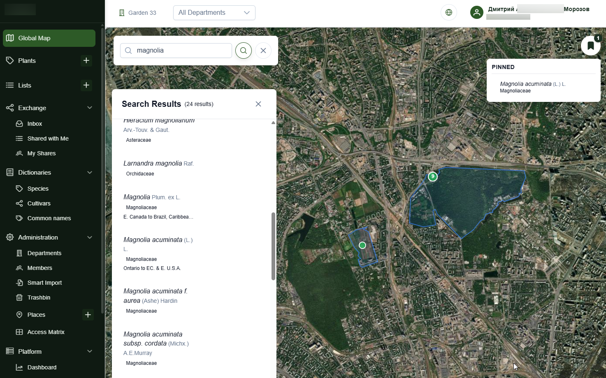
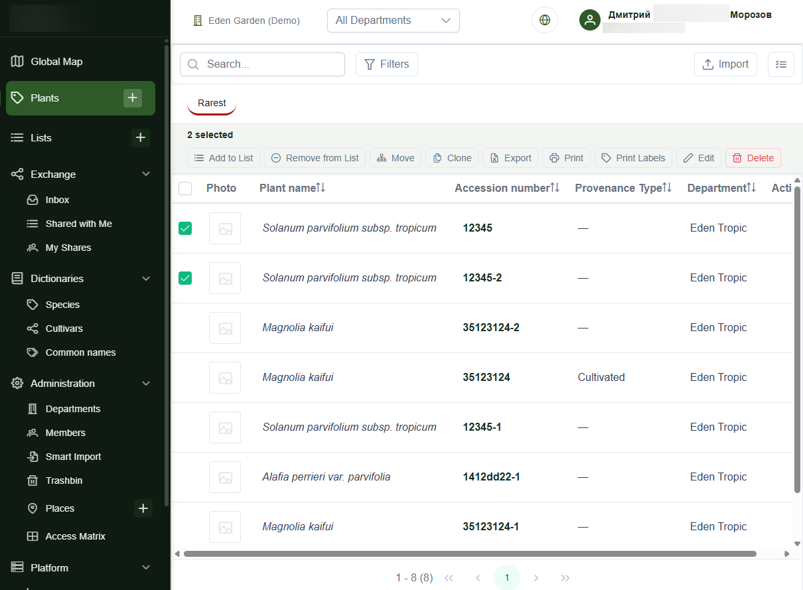
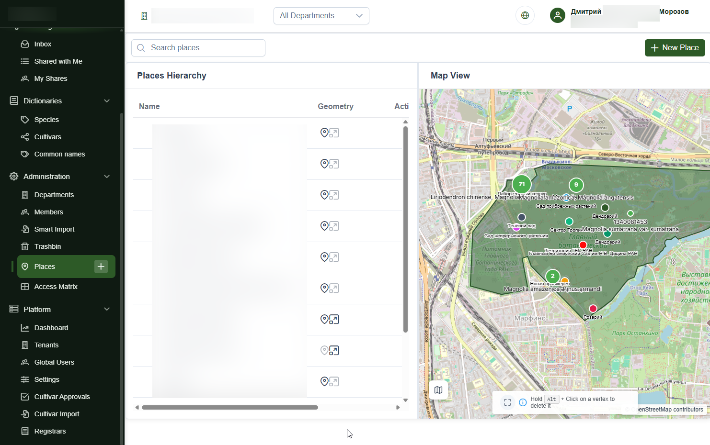
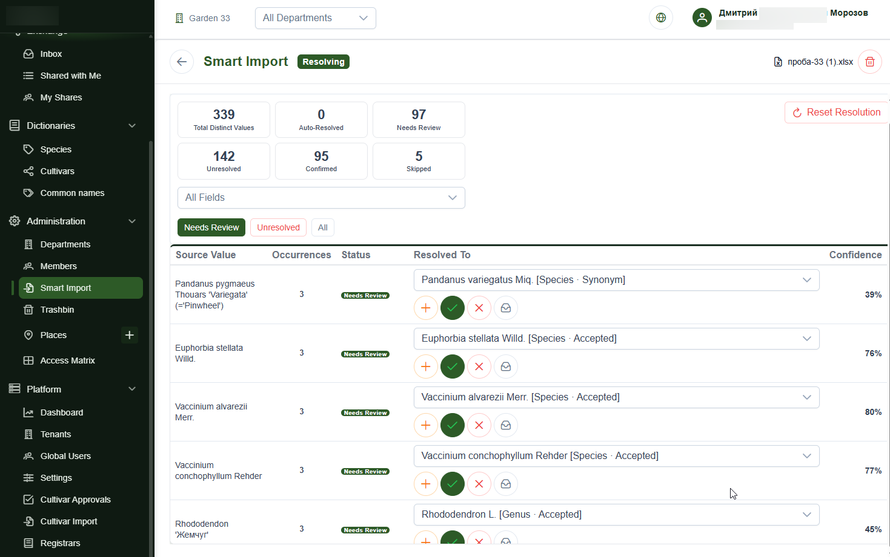
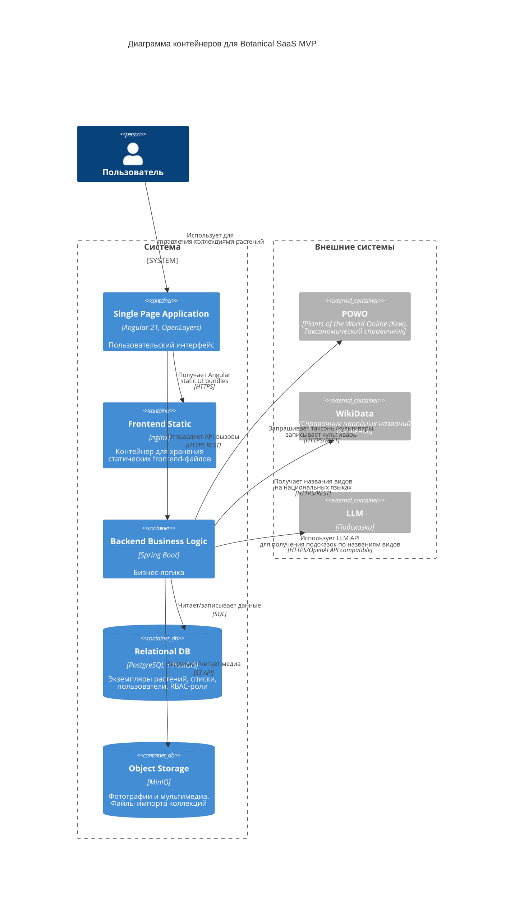

# Платформа для ботанических садов (SaaS)

**Статус:** MVP / подготовка к пилотному запуску
**Роль:** сооснователь, системный проектировщик, backend-oriented engineer
**Платформа:** Web SaaS
**Стек:** Java 21, Spring Boot, PostgreSQL/PostGIS, MinIO/S3-compatible storage, Angular, OpenLayers, Docker

## Краткое описание

Botanical SaaS — мультитенантная SaaS-платформа для ботанических садов, питомников, селекционеров, научных коллекций и частных собраний растений.

Система заменяет разрозненные Excel-файлы, локальные базы данных и устаревшие desktop-инструменты единой web-платформой для управления живыми коллекциями растений, научной таксономией, геоданными, публичными страницами организаций, QR-этикетками, импортом, списками и контролируемым обменом данными.

Моя зона ответственности включала доменное моделирование, backend-архитектуру, проектирование модели доступа, проектирование структуры данных и API, техническую документацию, backend-реализацию и подготовку системы к cloud-ready deployment.

## Проблема продукта

Ботанические коллекции часто ведутся в разрозненных таблицах, локальных базах и внутренних документах отдельных организаций. Это затрудняет:

* поддержание консистентных записей о растениях;
* привязку растений к проверенной научной таксономии;
* отслеживание местоположения растений и изменений их состояния;
* управление доступом между подразделениями и организациями;
* безопасный импорт исторических данных;
* публичную публикацию выбранных данных о коллекции;
* обмен информацией между учреждениями и коллекционерами.

Botanical SaaS решает эту проблему как единая операционная платформа для живых коллекций растений.

## Моя роль

Я выступал как сооснователь и технический владелец архитектуры системы.

Моя работа включала:

* перевод экспертных знаний предметной области в структурированную SaaS-модель;
* проектирование backend-архитектуры, API, структур данных и сервисных границ;
* реализацию backend-функциональности и интеграционной логики;
* проектирование tenant-aware access control и прав доступа в контексте организации;
* моделирование экземпляров растений, таксономии, мест размещения, списков, фотографий, импортов и публичных страниц;
* подготовку архитектурной документации, C4-диаграмм, ADR-style решений и implementation context;
* согласование технических решений с экспертом предметной области;
* использование AI-assisted development tools для ускорения рутинной реализации при сохранении ручного контроля над архитектурой, моделью данных, API-контрактами, ревью и deployment-решениями.

## Ключевые реализованные возможности

### Управление коллекцией

Система поддерживает учет инвентаризованных экземпляров растений с метаданными, статусом, происхождением, условиями выращивания, custom fields, фотографиями, списками и lifecycle-данными.

Реализованы поиск растений, фильтрация, массовые операции, soft delete, восстановление из корзины и экспорт в Excel.

### Научная таксономия

Записи о растениях связаны с централизованным таксономическим слоем на базе POWO/IPNI.

Модель поддерживает семейства, роды, виды, культивары, грексы, глобальные таксоны и локальные cultivated entities, принадлежащие отдельным тенантам.

### Мультитенантность и контроль доступа

Платформа использует soft multi-tenancy model на базе root organization unit pattern.

Пользователь может состоять в нескольких организациях и иметь разные роли в зависимости от текущего организационного контекста. Проверки доступа применяются на уровне сервисов, репозиториев, API и UI.

### GIS и картографический слой

Система рассматривает spatial data как часть доменной модели, а не как декоративный слой визуализации.

Поддерживаются геоданные растений и мест размещения, PostGIS points and polygons, участки сада, оранжереи, грядки, редактор карты, позиционирование растений и публичные картографические сценарии.

### Smart Import

Платформа включает guided spreadsheet import pipeline для переноса существующих коллекций растений.

Import flow поддерживает загрузку файла, выбор листа, сопоставление колонок, resolution значений, fuzzy matching, асинхронную обработку, построчные результаты и экспорт отчета по ошибкам.

### Публичная витрина

Организации могут публиковать выбранные данные через публичные страницы, публичные карточки растений, публичные списки, QR-label targets и глобальную карту.

Публичный слой использует отдельные DTO и visibility rules, чтобы не раскрывать внутренние поля и данные тенанта.

### Инфраструктура и deployment

Проект спроектирован как практичный cloud-ready MVP:

* разделенные frontend и backend;
* containerized services;
* PostgreSQL/PostGIS database;
* MinIO/S3-compatible storage для медиа и import-файлов;
* schema migrations через Flyway;
* production profile на базе environment configuration;
* базовый CI/CD и deployment automation path.

## Ключевые архитектурные решения

### Разделение frontend и backend

Система использует отдельный Angular frontend и Spring Boot backend API. Это снижает связность, позволяет независимо развивать UI и backend-логику, а также создает основу для будущих клиентских каналов.

### Root-unit soft multi-tenancy

Каждый tenant представлен корневым organizational unit. Tenant-scoped entities содержат `root_unit_id`, а доступ ограничивается через repositories, specifications, services и API-level checks.

Такой подход снижает операционную сложность на ранней стадии по сравнению с database-per-tenant, но сохраняет изоляцию данных и возможность использовать общие reference data.

### Context-aware authorization

Права доступа зависят не только от глобальной роли пользователя, но и от текущей организации и выбранного организационного контекста.

Это соответствует B2B-сценариям, где один и тот же пользователь может иметь разные права в разных организациях или подразделениях.

### PostGIS как часть доменной модели

Местоположение растений, участки сада, оранжереи, грядки и полигоны моделируются как spatial data, а не как вторичный map overlay.

### Гибридная модель текущего состояния и истории

Система разделяет текущее операционное состояние и данные, связанные с историей изменений и audit trail. Это позволяет эффективно работать с текущими записями и сохранять трассируемость важных изменений.

### Контролируемое публичное раскрытие данных

Публичные страницы, карточки растений, списки, фотографии и данные карты публикуются через отдельные public endpoints и DTO.

Visibility rules предотвращают случайное раскрытие внутренних данных тенанта.

## Применение ИИ

Проект разрабатывался с использованием AI-assisted engineering workflow.

LLM-based tools применялись для ускорения рутинной реализации, генерации boilerplate и быстрых итераций. Ключевые решения оставались под ручным контролем:

* интерпретация требований;
* доменное моделирование;
* архитектурные решения;
* границы данных;
* модель доступа;
* code review;
* debugging;
* deployment decisions;
* техническая документация.

Этот подход напрямую применим к MVP rescue work: ревью AI-generated code, выявление структурных проблем, стабилизация реализации и превращение прототипа в поддерживаемую deployable system.

## Практическая релевантность

Этот проект демонстрирует способность работать на стыке системного анализа, backend design, implementation и deployment preparation.

Он особенно релевантен для задач:

* rescue и стабилизации SaaS MVP;
* реструктуризации backend/API;
* проектирования multi-tenant business applications;
* cleanup базы данных и миграций;
* GIS-enabled systems;
* spreadsheet import pipelines;
* подготовки cloud deployment;
* архитектурной документации для fast-moving teams;
* контролируемого применения AI-assisted development.

## Пример UI

### Глобальная карта
<figure markdown>

<figcaption>Глобальная карта</figcaption>
</figure>

### Управление растениями
<figure markdown>

<figcaption>Управление растениями</figcaption>
</figure>

### Управление местами и границами
<figure markdown>

<figcaption>Управление местами и границами</figcaption>
</figure>

### Импорт растений с AI-поддержкой
<figure markdown>

<figcaption>Импорт растений с AI-поддержкой</figcaption>
</figure>

## Архитектурные артефакты

### Диаграмма контейнеров
