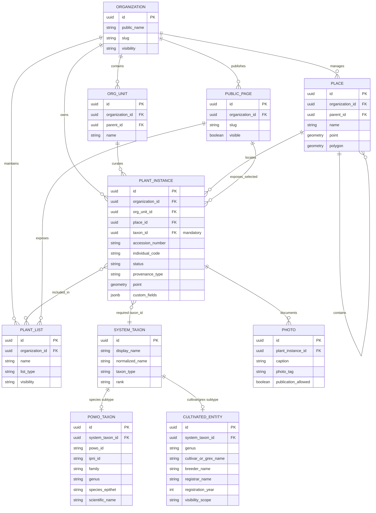

## Модель данных

### High-Level Data Model

### Ключевая идея модели

Центральная сущность системы - **PlantInstance**, цифровой двойник конкретного растения в живой коллекции. Это не просто строка справочника и не абстрактный вид, а учётная запись конкретного экземпляра: с инвентарным номером, статусом, местом размещения, принадлежностью к организации, фотографиями, списками и публичным представлением.

Обязательный атрибут **`taxon_id`** является ядром модели. Он связывает каждый экземпляр растения с единой корневой сущностью **SystemTaxon**. Благодаря этому все операционные сценарии - учёт, импорт, поиск, списки, обмен, QR-страницы, отчётность и публичная карта -работают не с произвольным текстовым названием растения, а с устойчивым идентификатором таксона.

**SystemTaxon** выступает общей корневой сущностью для двух крупных таксономических контуров:

* **PowoTaxon** - видовые таксоны, поступающие из авторитетного каталога POWO/IPNI.
* **CultivatedEntity** - культивары и грексы, которые могут быть признанными глобальными записями, поступающими от регистраторов, либо локальными записями, созданными внутри конкретной организации.

Такой подход позволяет пользователю выбирать растение из единого taxon lookup, не разделяя искусственно поиск по видам и поиск по культиварам. Для пользователя это выглядит как единый справочник растений, а внутри системы сохраняется различие между научными видовыми таксонами, глобальными культиварами, грексами и локальными культиварами организации.

Архитектурная ценность решения состоит в том, что все коллекционные данные становятся сопоставимыми между организациями. Один и тот же `taxon_id` может использоваться в карточках растений, списках коллекций, wishlists, списках обмена, публичных страницах и отчётах. Это создаёт основу для сетевых сценариев: система может сопоставлять, какие таксоны одна организация ищет, а другая готова передать, не полагаясь на нестабильные текстовые названия, синонимы, локальные варианты и опечатки.

В портфолио модель показана верхнеуровнево. Внутренние вспомогательные сущности, механизмы разграничения видимости, таблицы доступа, workflow глобализации культиваров и технические детали реализации намеренно опущены.
