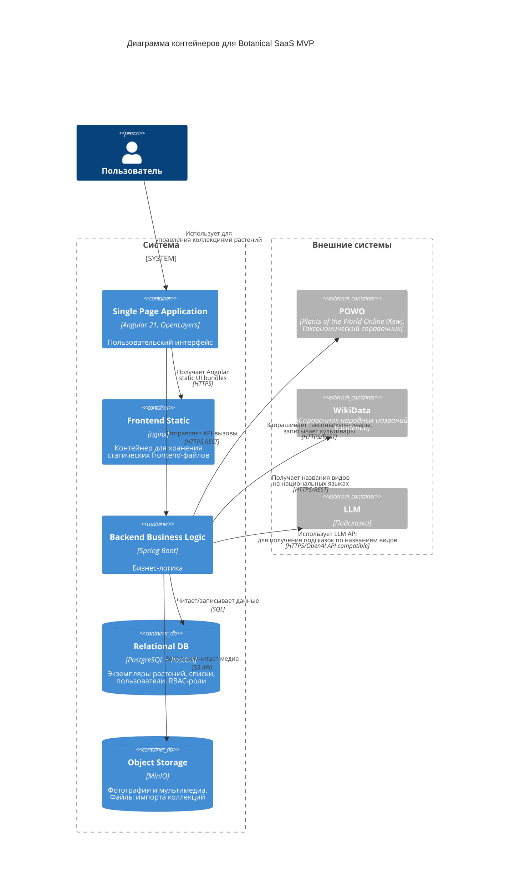

## Архитектура

### Контейнерная диаграмма (C4 Container)

```mermaid
    C4Container
    title Диаграмма контейнеров для Botanical SaaS MVP

    Person(user, "Пользователь")

    System_Boundary(sys, "Система") {
      Container(spa, "Single Page Application", "Angular 21, OpenLayers", "Пользовательский интерфейс") 
      Container(static, "Frontend Static", "nginx", "Контейнер для хранения<br/> статических frontend-файлов")
      Container(backend, "Backend Business Logic", "Spring Boot", "Бизнес-логика")
      ContainerDb(reldb, "Relational DB", "PostgreSQL + PostGIS", "Экземпляры растений, списки,<br/> пользователи, RBAC-роли")
      ContainerDb(objStore, "Object Storage", "MinIO", "Фотографии и мультимедиа.<br/> Файлы импорта коллекций")
    }

    Boundary(ext, "Внешние системы", "") {
      Container_Ext(powo, "POWO", "Plants of the World Online (Kew).<br/> Таксономический справочник")
      Container_Ext(vernacular, "WikiData", "Справочник народных названий<br/> растений")
      Container_Ext(llm, "LLM", "Подсказки")
    }

  Rel(user, spa, "Использует для<br/> управления коллекциями растений")

  Rel(spa, static, "Получает Angular<br/> static UI bundles", "HTTPS")
  Rel(spa, backend, "Отправляет API-вызовы", "HTTPS REST")

  Rel(backend, reldb, "Читает/записывает данные", "SQL")
  Rel(backend, objStore, "Загружает/читает медиа", "S3 API")

  Rel(backend, powo, "Запрашивает таксоны/культивары,<br/> записывает культивары", "HTTPS/REST")
  Rel(backend, vernacular, "Получает названия видов<br/> на национальных языках", "HTTPS/REST")
  Rel(backend, llm, "Использует LLM API<br/> для получения подсказок по названиям видов", "HTTPS/OpenAI API compatible")

  UpdateLayoutConfig($c4ShapeInRow="5", $c4BoundaryInRow="3")

```
