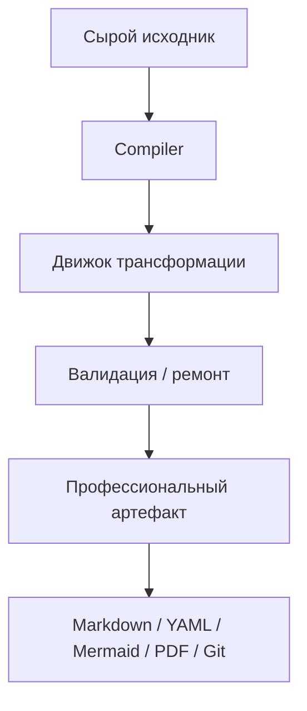

# Обзор

DocCompile - платформа компиляции профессиональных артефактов в развитии. Она началась как издатель в модели docs-as-code и движется к слою обработки, который компилирует сырой исходный материал в профессиональные артефакты.

Исходная продуктовая формула:

```text
Markdown
+ Mermaid
+ иконки архитектуры
+ изображения
+ профессиональные темы
-> PDF
```

Текущая продуктовая формула:

> Source in. Contract satisfied. Artifact out.

Развёрнутая формулировка: компилировать сырой исходный материал в профессиональные артефакты, которые удовлетворяют явным контрактам, опираются на свидетельства и остаются согласованными во всех выходах.

DocCompile не должен конкурировать за место, где живут документы. Он должен конкурировать за момент, когда сырой исходный материал становится корректным профессиональным артефактом.

## Эволюция продукта

1. **Издатель docs-as-code.** Портативный Markdown, diagrams-as-code, профессиональные темы и экспорт PDF, рендер локально в браузере.
2. **SaaS-контур.** Аутентификация, административная control plane, кредиты, биллинг и серверные AI-трансформации на AWS.
3. **Стратегический разворот.** Снизить приоритет проприетарного облачного workspace / хранения документов. Владеть трансформацией, а не документом.
4. **Целевая платформа Compiler.** Compiler - это контракт трансформации. Универсальный Harness исполняет этот контракт без жёстко прошитой оркестрации под каждый тип артефакта.

## Реализовано и целевое

### Реализовано

Рабочая система включает локально-ориентированный рендерер Markdown с Mermaid, иконками архитектуры, темами, изображениями, печатной вёрсткой и экспортом PDF; SPA и serverless-бэкенд, развёрнутые в AWS; идентичность через Cognito и административную control plane; runtime / версионированные промпты; тарифицируемые кредитами AI-трансформации; коммерческий контур вокруг Paddle.

Рабочие AI-трансформации сейчас есть как минимум для ADR, требований (FR/NFR, бизнес-правила, ограничения) и Resume / CV. Точный список Compiler, жизненный цикл публикации и режим биллинга (Live vs sandbox) следует подтверждать по продуктовому репозиторию.

### Целевое / запланировано

Следующая архитектура - универсальный Transformation Harness, управляемый Artifact Contract, свидетельствами / каноническими фактами, настраиваемыми шаблонами выхода, Situations (пакеты из нескольких артефактов) и позднее Patch Compile. Здесь это не подаётся как уже развёрнутое поведение.

## Концептуальный поток



Валидация, ремонт, Git-native sinks и компиляция по контракту - целевой путь Harness. Реализованный путь сегодня - локальный рендеринг плюс AI-задачи на каждую трансформацию.

## Основные акторы

| Актор | Роль |
|---|---|
| Автор / профессиональный пользователь | Пишет или вставляет Markdown локально; экспортирует PDF; опционально запрашивает AI-компиляцию |
| Admin / Super Admin | Runtime-конфигурация, версии промптов, наблюдаемость трансформаций, публикация Compiler |
| Compiler | Контракт трансформации для одного класса профессионального артефакта |
| Harness | Целевая универсальная оркестрация, исполняющая контракт Compiler |
| LLM-провайдер | Сменяемая реализация модели, а не продуктовый ров |

## Основные возможности

| Возможность | Статус |
|---|---|
| Рендеринг GFM / Markdown | Реализовано |
| Mermaid и иконки архитектуры | Реализовано |
| Профессиональные темы, печатная вёрстка, PDF | Реализовано |
| Локально-ориентированный рендеринг; содержимое по умолчанию остаётся в браузере | Реализовано |
| Аутентификация Cognito и RBAC | Реализовано |
| Runtime / версионированные промпты | Реализовано |
| Тарифицируемые кредитами AI-трансформации | Реализовано |
| Биллинговый контур Paddle | Реализовано; Live vs sandbox предстоит подтвердить |
| История трансформаций / административная наблюдаемость | Реализовано; глубину предстоит подтвердить |
| Универсальный Harness / Artifact Contract | Целевое |
| Evidence / Canonical Fact Model | Целевое |
| Situations и Patch Compile | Целевое |

## Технологический стек

| Слой | Выбор | Роль |
|---|---|---|
| UI | Клиентский SPA | Локальный рендеринг, редактор, экспорт |
| Доставка | CloudFront + private S3 origin / OAC | Статический frontend |
| API | API Gateway + Lambda | Аутентифицированные серверные операции |
| Состояние | DynamoDB | Задачи, кредиты, runtime-конфиг, промпты |
| Идентичность | Amazon Cognito | Регистрация, аутентификация, роли |
| Инфра | Terraform | Воспроизводимое окружение AWS |
| CI/CD | GitHub Actions + OIDC | Деплой без долгоживущих облачных credentials |
| Интеллект | Внешний LLM API | Сменяемый компонент генерации |
| Биллинг | Paddle | Платежи как merchant of record |

SQS, уведомления о результате по WebSocket, Step Functions и ECS Fargate фигурируют в архитектурном направлении; реализованными следует считать только фактически развёрнутые сервисы.
