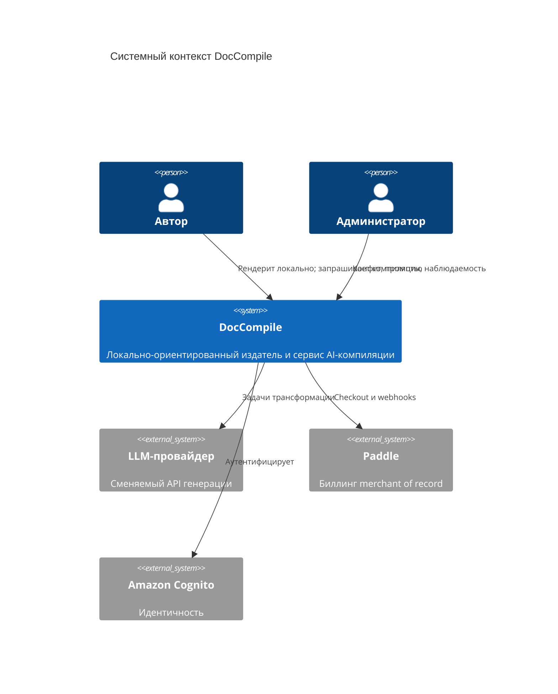
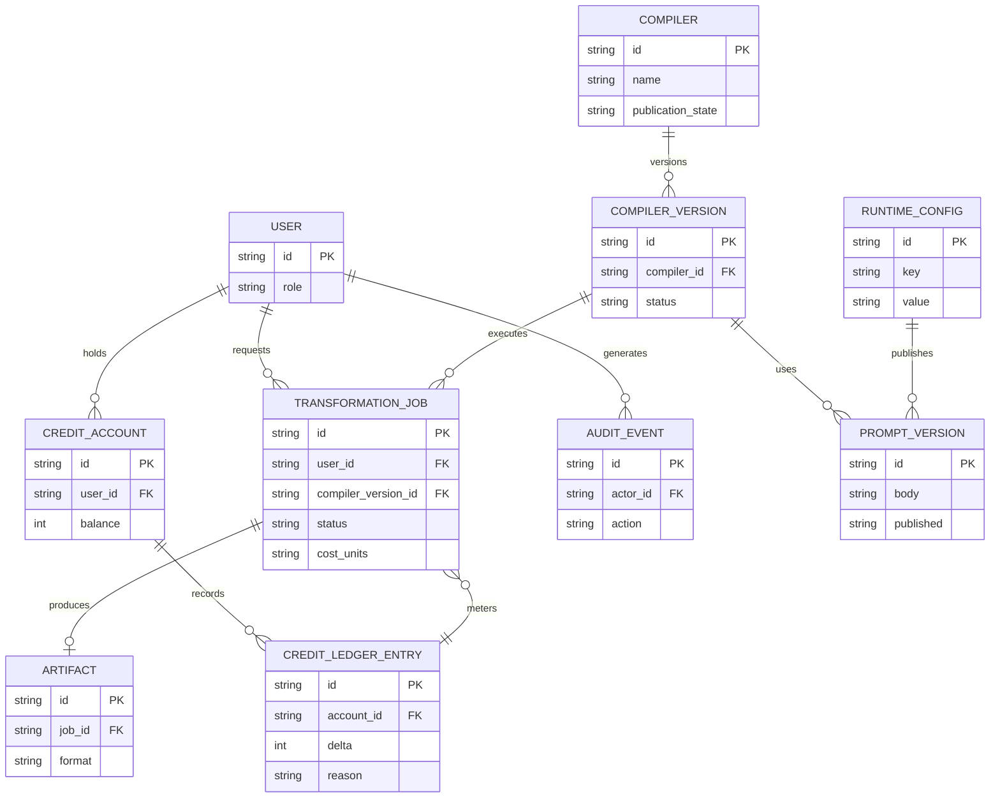

# Модель системы

## Доменная модель

Реализованный домен - локально-ориентированный издатель плюс serverless-контур AI-трансформаций. Будущие концепции Compiler / Harness перечислены отдельно и не входят в текущую модель данных.

### Реализованные концепции

| Концепция | Смысл |
|---|---|
| User | Аутентифицированная идентичность из Cognito |
| Role | USER, ADMIN, SUPER_ADMIN |
| Compiler | Именованный тип трансформации (исторически «Template») для класса артефакта |
| Compiler version | Исполняемая ревизия конфигурации Compiler / промпта |
| Output template | Презентационная структура артефакта; сейчас слабее отделена от логики Compiler, чем в целевой модели |
| Compile run / transformation job | Асинхронная серверная AI-задача со статусом, стоимостью и обработкой результата |
| Artifact | Сгенерированный Markdown / документный выход запуска |
| Credit account | Баланс пользователя для compute-тяжёлых операций |
| Credit ledger entry | Атрибутируемое списание / начисление использования |
| Runtime configuration | Серверные настройки, которые можно менять без деплоя |
| Prompt definition / prompt version | Версионированное поведение ИИ с публикацией / откатом |
| Audit event | След чувствительных административных действий и трансформаций |

Точные имена таблиц и атрибуты в публичном пакете опущены.

### Целевые / запланированные концепции

Их нельзя читать как реализованные сущности:

| Концепция | Смысл |
|---|---|
| Artifact Contract | Объективное определение успеха для Compiler: разбор, схема, свидетельства, ограничения вёрстки |
| Fact | Каноническое извлечённое утверждение со статусом (asserted / uncertain / conflicting / unknown) |
| Evidence | Указатель происхождения от Fact обратно к исходному материалу |
| Situation | Оркестрация нескольких Compiler вокруг одной цели пользователя |
| Artifact pack | Набор связанных артефактов, которые должны оставаться согласованными |
| Patch Compile | Brownfield-обновление существующего артефакта вместо полной регенерации |

## Контекстная диаграмма



## Модель данных

### Высокоуровневая реализованная модель



`publication_state` (PUBLIC / INTERNAL / DISABLED) - целевой жизненный цикл Compiler. Если продуктовый репозиторий ещё не сохраняет его, считать запланированным.

### Целевая модель фактов (не реализована)

```text
Fact
├── id
├── concept
├── value
├── status: asserted | uncertain | conflicting | unknown
├── evidence[]
├── source
└── provenance
```

Примеры доменных фактов (планируются): RequirementFact, BusinessRuleFact, ConstraintFact, NfrFact, EndpointFact, EmploymentFact, SkillFact.

## Ключевая идея модели

Центр тяжести реализации - **transformation job**: явный, тарифицируемый, асинхронный запрос компиляции. Локальные документы не являются источником истины системы в облаке; они остаются у пользователя, пока не запрошена задача.

Целевой центр тяжести - **контракт Compiler**: входной контракт, схема фактов, контракт артефакта, валидаторы, стратегии ремонта и метрики качества. Добавление Compiler не должно требовать изменения оркестрации Harness.

## Концепция Compiler

Compiler - это не просто каркас Markdown. Это контракт трансформации для конкретного класса профессионального артефакта:

```text
Compiler
├── Input Contract
├── Fact Schema
├── Artifact Contract
├── Evidence / Grounding Rules
├── Output Template
├── Validators
├── Repair Strategies
├── Presentation Constraints
└── Quality Metrics
```

Архитектурный принцип (целевой):

```text
Artifact Contract
=
Compiler Invariants
+ Output Template
+ User Options
+ Organization Rules
```

Пользовательский шаблон может менять структуру артефакта, но не должен ослаблять гарантии Compiler.

Примеры текущих / планируемых Compiler: ADR; Requirements Specification; Resume / CV; API Contract; System Design; Meeting Summary; Proposal; Executive Summary. Как рабочие трансформации сегодня заявлены только первые из списка.

## API-контракты

Имена эндпоинтов в публичном пакете иллюстративны. Бэкенд предоставляет REST/JSON API для SaaS-операций, закрытых идентичностью. Локальный рендеринг через этот API не идёт.

Группы возможностей:

* аутентификация через Cognito;
* submit / status / result задачи трансформации;
* баланс кредитов и ledger;
* административная runtime-конфигурация и версии промптов;
* биллинговые webhooks от Paddle.

Слои безопасности:

* JWT от Cognito на аутентифицированных маршрутах;
* проверки ролей для операций ADMIN / SUPER_ADMIN;
* секреты и ключи провайдера остаются на сервере;
* маршруты webhook проверяют подписи Paddle;
* результаты задач доступны владельцу, кроме административной наблюдаемости.

### Жизненный цикл задачи трансформации (реализованное направление)

```text
submit
-> queued / running
-> succeeded | failed
-> result available to owner
```

Имена статусов в коде могут отличаться. Инвариант: задача атрибутируема, тарифицируема и инспектируема; это не свободная чат-сессия.

### Паттерн обработки ошибок

Типичные статусы:

```text
200 OK                  успешное чтение
202 Accepted            задача принята
400 Bad Request         некорректный ввод
401 Unauthorized        отсутствует или невалидна идентичность
403 Forbidden           аутентифицирован, но не разрешено
404 Not Found           ресурс отсутствует или невидим
409 Conflict            конфликт состояния
429 Too Many Requests   лимит частоты или кредитов
```
