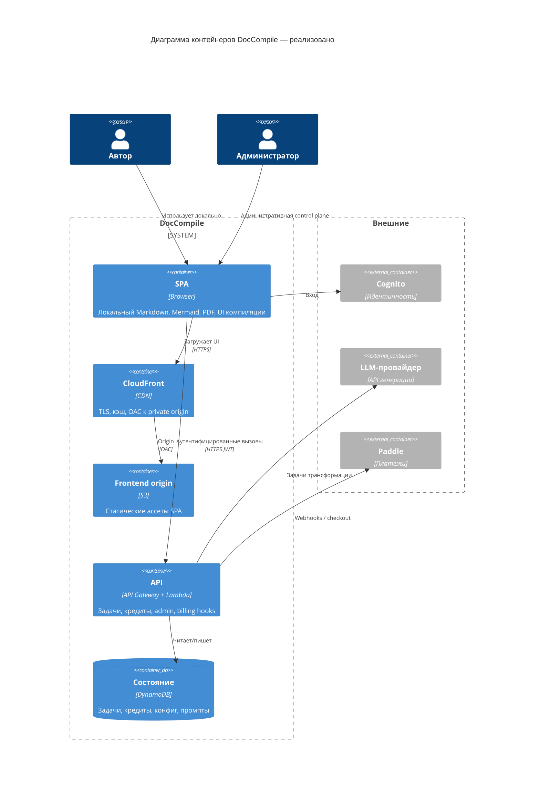
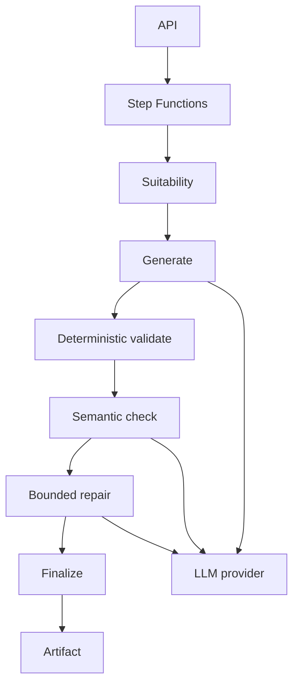

# Архитектура и интеграции

## Текущая архитектура

Реализованная система — клиентский SPA с serverless-бэкендом AWS для идентичности, биллинга, конфигурации и AI-задач.

```text
Browser SPA
    → CloudFront
    → private S3 origin (OAC)

Аутентифицированные / серверные операции:
Browser
    → API Gateway
    → Lambda
    → DynamoDB / SQS / внешние сервисы
```

Тела больших документов не являются payload бэкенда по умолчанию. Локальный рендеринг, Mermaid, темы, ассеты и операции с PDF выполняются в браузере. Содержимое отправляется на сервер, когда пользователь явно запускает AI-трансформацию.

AI-обработка использует асинхронную модель задач вокруг серверных workers и внешнего LLM-провайдера. Точное использование SQS, уведомлений по WebSocket и polling следует подтверждать по продуктовому репозиторию. Не читать Step Functions или ECS Fargate как уже развёрнутые, пока они не присутствуют в этом репозитории.

```mermaid
architecture-beta
    service front(aws:cloudfront)[CloudFront]
    service static(aws:simple-storage-service)[Private S3 origin]
    service api(aws:api-gateway)[API Gateway]
    service lambda(aws:lambda)[Lambda]
    service dynamo(aws:dynamodb)[DynamoDB]
    service cognito(aws:cognito)[Cognito]
    service browser(logos:chrome)[Browser]
    service llm(logos:openai)[LLM provider]
    service paddle(logos:webhooks)[Paddle]

    browser:T --> B:front
    front:T --> B:static
    browser:R --> L:cognito
    browser:B --> T:api
    api:R --> L:lambda
    lambda:R --> L:dynamo
    lambda:B --> T:llm
    lambda:T --> B:paddle
```





Инфраструктура управляется Terraform. Деплои идут через GitHub Actions с OIDC, а не через долгоживущие облачные credentials.

### Потоки интеграции

**Локальная публикация.** Браузер загружает SPA с CloudFront, рендерит Markdown / Mermaid локально и экспортирует PDF локально. Загрузки документа нет.

**Аутентифицированная компиляция.** Пользователь входит через Cognito, отправляет задачу трансформации через API Gateway, тратит кредиты и получает результат, когда worker завершается. LLM-провайдер — деталь реализации за этой задачей.

**Биллинг.** Checkout и покупка подписки / кредитов идут через Paddle. Бэкенд доверяет проверенным webhooks, а не браузеру, для платных entitlements.

**Администрирование.** Повышенные роли меняют runtime-конфигурацию и версии промптов, просматривают историю трансформаций и откатывают опубликованную конфигурацию промптов.

## Целевая / планируемая архитектура

Центральный будущий дифференциатор — универсальный Transformation Harness. В нём не должно быть жёстко прошитых ветвей вида `if Resume` / `if ADR` / `if Requirements`. Он исполняет контракт, который поставляет Compiler.

```text
Source
  ↓
Suitability
  ↓
Fact / Evidence Extraction
  ↓
Generation
  ↓
Deterministic Validation
  ↓
Semantic Checking
  ↓
Repair
  ↓
Final Validation
  ↓
Artifact
```

Направление оркестрации:

```text
API
  ↓
Step Functions
  ↓
generic stages / workers
  ↓
external LLM provider
```



Возможности Harness (целевые): исполнение стадий, вызов модели, детерминированные валидаторы, семантические валидаторы, структурированные отчёты о нарушениях, ограниченные циклы ремонта, политики retry, provenance, учёт токенов / стоимости, трассировка исполнения, безопасные границы отмены.

Инвариант: добавление нового Compiler не должно требовать изменения ядра оркестрации Harness.

### Будущее разделение compute

| Compute | Когда |
|---|---|
| Lambda | Лёгкие / serverless-стадии |
| ECS Fargate | Тяжёлые ограниченные workers (например Chromium / детерминированная публикация), когда лимитов Lambda недостаточно |
| EC2 / GPU | Только если self-hosted inference или устойчивая нагрузка позднее это оправдают |

Принцип: сначала serverless-оркестрация; специализированный compute только когда нагрузка его оправдывает. EC2 и контейнеры не входят в документированную текущую архитектуру.
