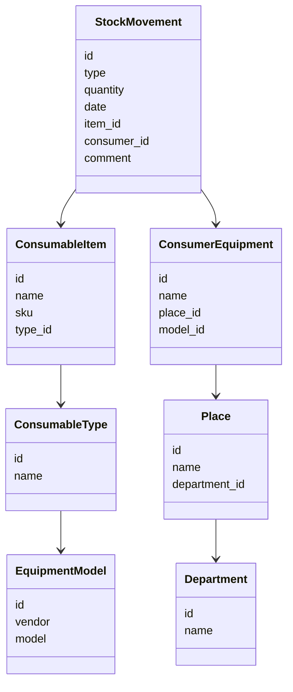

# Внутренняя система учёта расходных материалов

**Тип:** Internal automation / early ERP-like inventory system
**Роль:** инициатор, автор концепции, разработчик прототипа
**Статус:** partial implementation / historical project
**Период:** ранний этап перехода от администрирования инфраструктурой к разработке внутренних систем

## Контекст

Проект возник из практической операционной боли ИТ-отдела: расходные материалы закупались, выдавались, списывались и планировались вручную или в разрозненных таблицах. Основной объект учёта - картриджи для принтеров и другие ИТ-расходники, связанные с регулярными закупками, остатками, выдачей, заменой и прогнозированием потребности.

Идея заключалась в создании лёгкой внутренней ERP-системы для отдела ИТ: не как большой корпоративной платформы, а как прикладного инструмента, который помогает видеть текущие остатки, историю движения материалов и будущую потребность в закупках.

## Проблема

До появления такой инициативы учёт расходников был зависим от ручной дисциплины, локальных файлов и памяти сотрудников. Это создавало типовые проблемы:

* сложно быстро понять актуальные остатки;
* трудно восстановить историю поступления и выдачи;
* закупки планировались реактивно, а не на основе накопленных данных;
* не было единой структуры справочников и операций;
* данные были полезны для отдела, но плохо формализованы как система.

## Цель проекта

Создать внутренний инструмент для учёта расходных материалов, который позволял бы:

* вести справочник расходников;
* фиксировать поступления;
* учитывать выдачу и списание;
* видеть текущие остатки;
* анализировать динамику потребления;
* поддерживать планирование закупок;
* снизить зависимость от ручного учёта и разрозненных таблиц.

## Реализация

Проект был начат как самостоятельная разработка с нуля, но не оформлен, как законченная ERP-система. Однако проект важен не как завершённый production-продукт, а как ранняя точка перехода от роли системного администратора к роли человека, который проектирует и создаёт прикладные ИТ-системы.

## Предметная модель

В основе решения лежала простая, но прикладная доменная модель:

* расходный материал;
* тип расходника;
* модель оборудования;
* совместимость расходника и оборудования;
* складской остаток;
* поступление;
* выдача;
* списание;
* подразделение или место использования;
* история движения;
* плановая потребность;
* закупочная заявка или закупочная потребность.

## Архитектурный подход

Проект задумывался как многослойный модульный монолит: прикладная логика, модель данных, простой пользовательский интерфейс и слой хранения должны были быть разделены по ответственности, но без преждевременного усложнения архитектуры.

На текущем уровне зрелости проекта корректнее рассматривать его как early internal automation prototype, а не как завершённую ERP-систему.

## Что было реализовано частично

* Концепция внутренней системы учёта расходников.
* Базовая структура справочников и операций.
* Подход к фиксации поступлений и расхода.
* Табличная модель для практического учёта.
* Использование накопленных данных для планирования закупок.
* Переход от хаотичного ручного учёта к более структурированной модели.

## Технологический стек
- Spring Boot backend
- Thymeleaf простой UI
- Локальный запуск 

## Диаграмма классов

## Что показывает проект

ExpendIt показывает мой ранний переход от инфраструктурной роли к разработке внутренних систем и системному анализу.

В этом проекте уже появились элементы, которые позже стали частью моего профессионального профиля:

* разбор реальной операционной боли;
* выделение сущностей предметной области;
* попытка построить модель учёта;
* стремление заменить ручной процесс структурированной системой;
* практическая автоматизация для внутреннего пользователя;
* внимание к данным, истории операций и планированию.

Проект не был завершён как зрелый продукт, но стал важным шагом в сторону системного мышления, разработки и последующего перехода в системный анализ.
