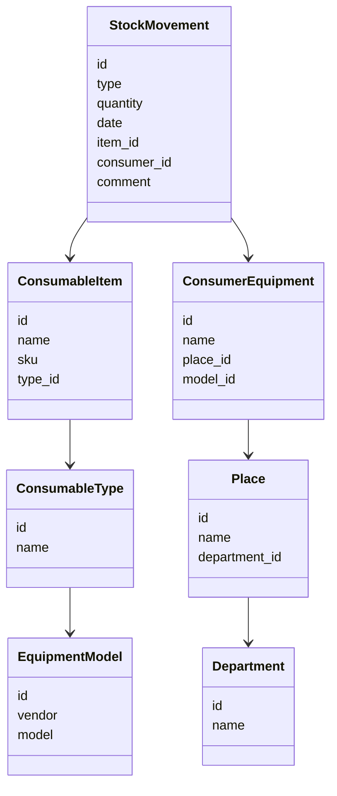

# Модель системы

## Доменная модель

В основе решения лежала простая, но прикладная доменная модель:

* расходный материал;
* тип расходника;
* модель оборудования;
* совместимость расходника и оборудования;
* складской остаток;
* поступление;
* выдача;
* списание;
* подразделение или место использования;
* история движения;
* плановая потребность;
* закупочная заявка или закупочная потребность.

## Модель данных

## Диаграмма классов

## API-контракты
