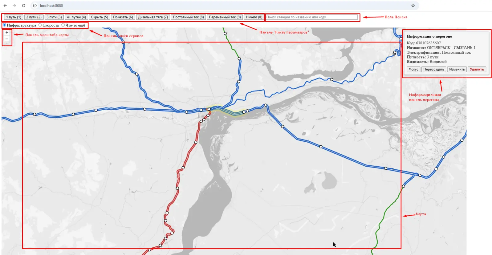
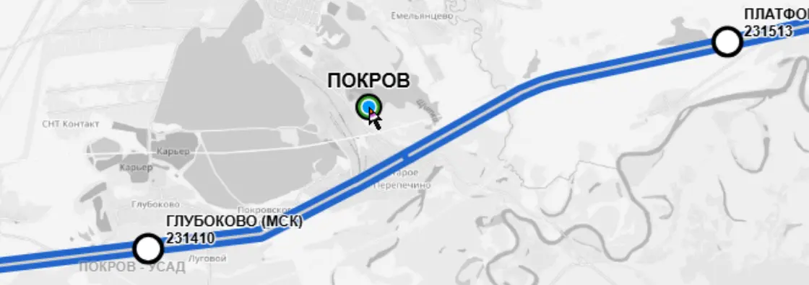
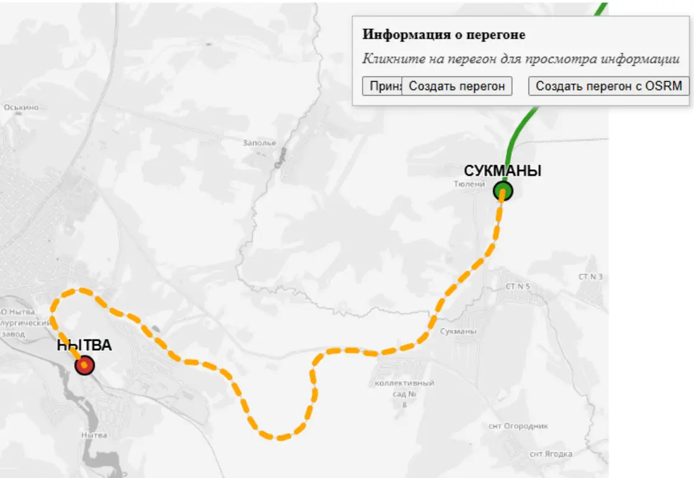
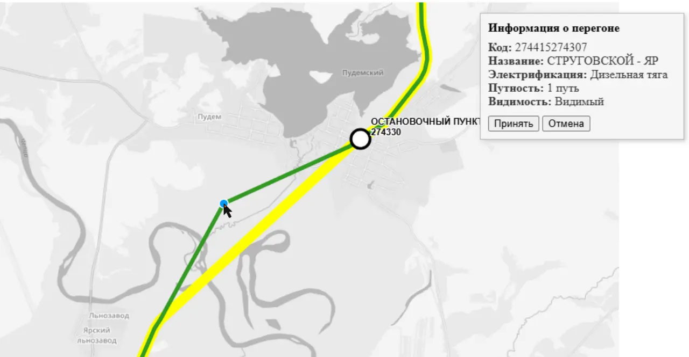
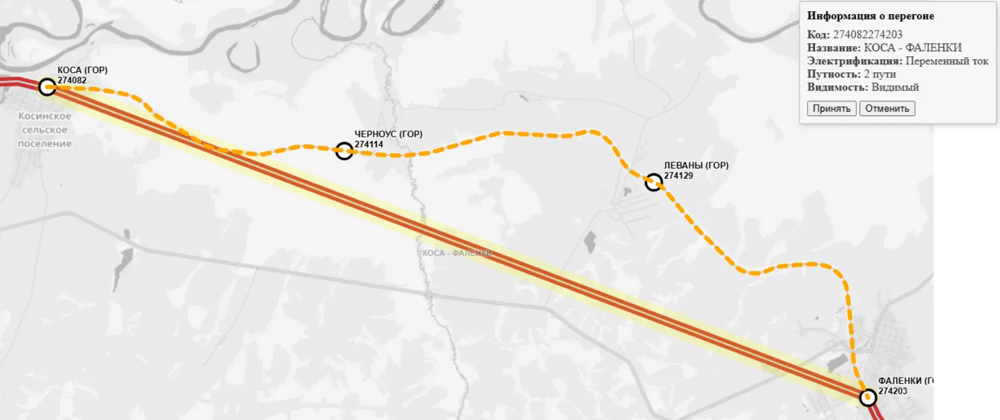

# Утилита редактирования полилиний железнодорожного графа

**Тип:** Internal tooling / подготовка GIS-данных / редактирование железнодорожного графа  
**Роль:** инициатор, автор концепции, разработчик  
**Статус:** historical internal project / развитие идеи продолжилось в GraphMechanic

## Обзор

Локальная веб-утилита для создания, редактирования и восстановления полилиний железнодорожных путей, использовавшихся при подготовке данных железнодорожного графа.

Проект возник из практической проблемы качества данных: объекты железнодорожной инфраструктуры нужно было связать с корректной геометрией, но ручная подготовка полилиний была медленной, подверженной ошибкам и плохо проверяемой без визуального инструмента.

Утилита давала лёгкий внутренний интерфейс для работы с геометрией железнодорожного графа: редактирование узлов, создание полилиний, генерация геометрии через routing service и восстановление некорректных или неполных участков пути.

## Контекст

Проект был создан в рамках enterprise GIS-инициативы, где данные железнодорожной инфраструктуры нужно было подготовить для картографической визуализации, маршрутизации и дальнейшего аналитического использования.

Исходные данные графа и инфраструктурные объекты требовали ручной очистки и выравнивания. Без отдельного инструмента такая работа требовала бы прямой правки данных, повторных проверок и постоянного вовлечения разработчиков.

Целью было создать небольшой прикладной инструмент, который позволит визуально редактировать данные и ускорить подготовку железнодорожного графа.

## Проблема

Команде требовался более управляемый и визуальный способ работы с геометрией железнодорожных путей.

Типовые проблемы:

- отсутствующая или некорректная геометрия полилиний;
- несвязанные узлы графа;
- участки железнодорожных путей, требующие ручной корректировки;
- сложность проверки геометрии только по сырым данным;
- медленная подготовка инфраструктурных объектов для дальнейшего использования;
- повторное вовлечение разработчиков в исправления данных, которые можно было выполнить визуально.

## Решение

Я спроектировал и реализовал локальную веб-утилиту для редактирования полилиний железнодорожного графа.

Инструмент поддерживал:

- просмотр объектов железнодорожного графа на карте;
- редактирование узлов графа;
- создание новых полилиний;
- генерацию полилиний через routing service;
- восстановление существующих полилиний через пересчёт маршрута;
- применение изменений без полной перезагрузки страницы;
- подготовку графовых данных для дальнейшего использования в GIS-системах.

## Роль и вклад

Я выступал как инициатор, автор концепции и разработчик.

Мой вклад включал:

- выявление потребности в отдельном визуальном инструменте редактирования;
- определение основных пользовательских сценариев очистки железнодорожного графа;
- проектирование структуры приложения;
- реализацию backend-части и серверной генерации страниц;
- реализацию интерактивного поведения интерфейса на JavaScript и jQuery;
- добавление асинхронной загрузки и обновления полилиний;
- поддержку практической подготовки данных по объектам железнодорожной инфраструктуры.

## Архитектурный подход

Утилита была реализована как многослойное монолитное веб-приложение.

Архитектура включала:

- серверную генерацию страниц;
- MVC-структуру;
- слой бизнес-логики;
- слой репозиториев;
- кеширование полилиний;
- асинхронную выдачу полилиний;
- jQuery-взаимодействия для частичных обновлений без полной перезагрузки страницы.

Такой подход был осознанно прагматичным: инструмент создавался для локального / внутреннего использования, быстрой итерации и практической подготовки данных, а не для долгосрочной продуктовой эксплуатации.

## Технологический стек

- Java / Spring Boot
- Server-side rendering
- MVC architecture
- Repository layer
- JavaScript / jQuery
- Map-based UI
- Routing service integration
- Polyline caching
- Asynchronous data loading

## Скриншоты интерфейса

<figure markdown>

<figcaption>Пользовательский интерфейс</figcaption>
</figure>

<figure markdown>

<figcaption>Редактирование узла</figcaption>
</figure>

<figure markdown>

<figcaption>Создание полилинии</figcaption>
</figure>

<figure markdown>

<figcaption>Генерация полилинии через routing service</figcaption>
</figure>

<figure markdown>

<figcaption>Восстановление полилинии через routing service</figcaption>
</figure>

## Что показывает проект

Проект показывает мой ранний переход от работы с требованиями и подготовкой данных к hands-on разработке внутренних инструментов.

Он демонстрирует способность:

- выявлять повторяющееся узкое место в подготовке данных;
- превращать ручную GIS/data-cleanup задачу в визуальный инструмент;
- проектировать прагматичное внутреннее приложение под узкую операционную проблему;
- совмещать backend-логику, картографический UI, маршрутизацию, кеширование и асинхронные взаимодействия;
- создавать инструменты, которые сокращают ручной труд и повышают качество данных.

Позднее проект концептуально развился в GraphMechanic — более широкую идею визуального редактирования графов и GIS-данных.

## Полная документация

- Документация в процессе заполнения.
- Направление проекта продолжается в GraphMechanic: [GraphMechanic](graph-mechanic.md)