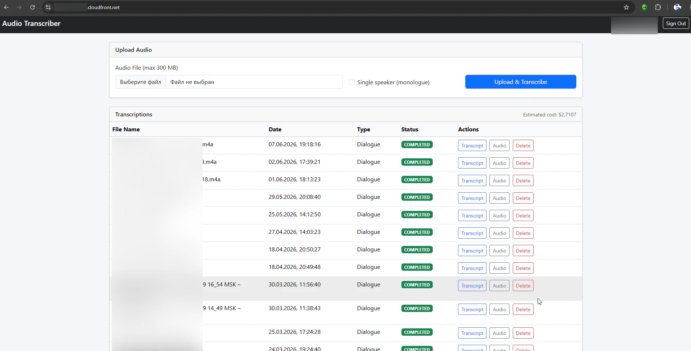
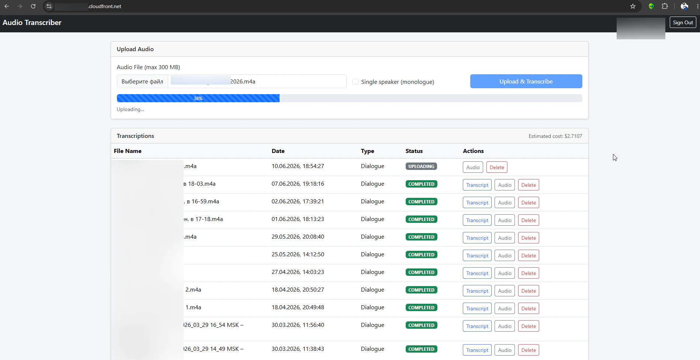
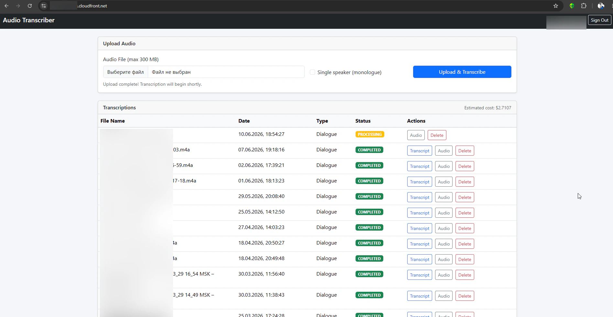
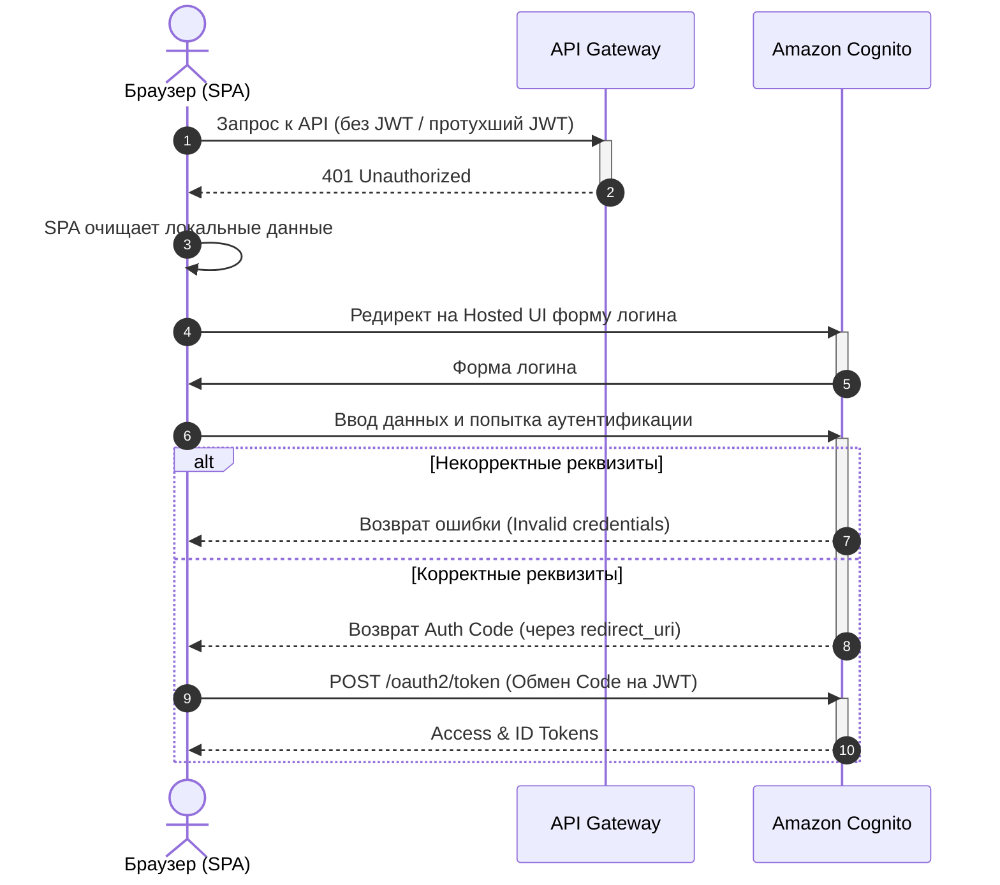
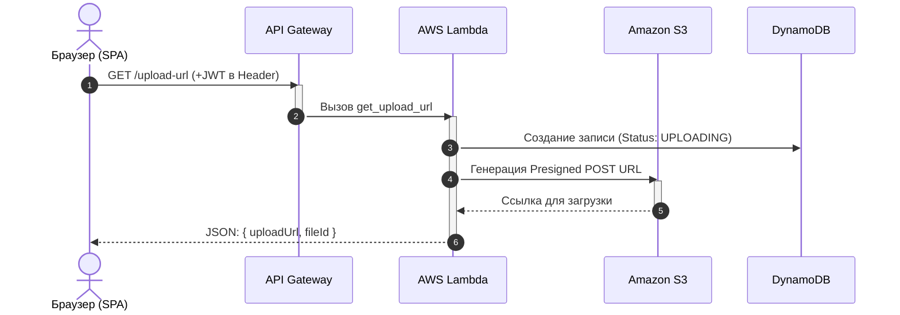
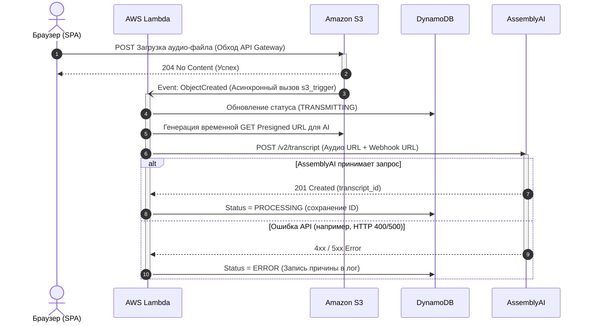
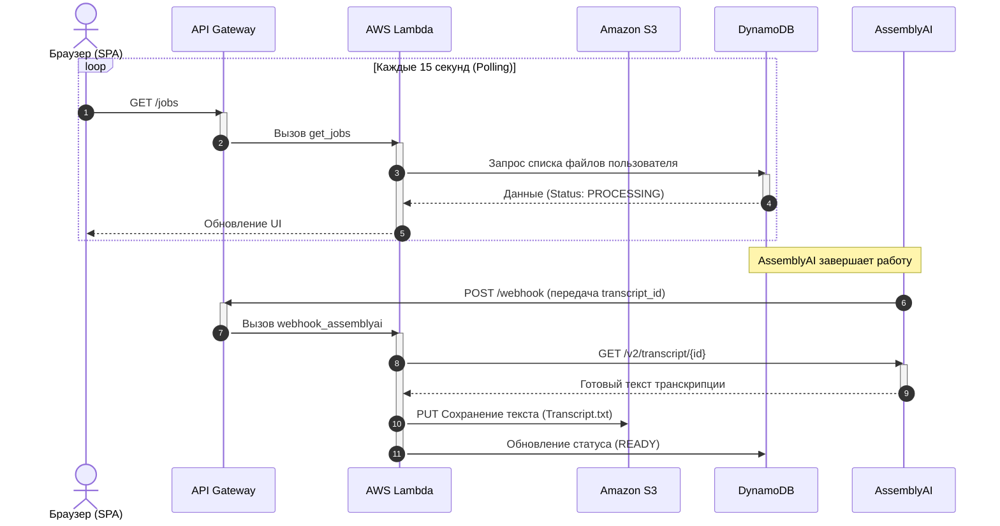
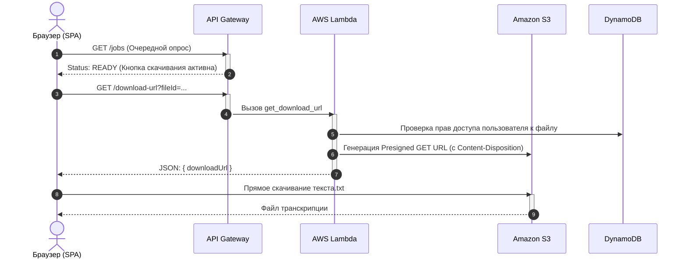

# Serverless Transcriber SaaS

**Статус:** active

## Обзор продукта
Бессерверное решение для транскрибации аудиозаписей посредством внешнего API-транскрибации. 

## Предпосылки
Есть эпизодическая необходимость в быстрой и дешевой транскрибации больших аудио-файлов (1.5ч+) с минимальными затратами на инфраструктуру. Низкая нагрузка и ограниченный круг пользователей (не более 40 часов записей в месяц для 1-3 пользователей).

## Требования
- Доступность с любого устройства, подключенного к сети интернет. 
- Регион доступности - Европейская часть Евразии.
- Оптимально минимальное использование инфраструктуры. 
- Размер файла записи - до 300мб
- Продолжительность записи - до 6 часов
- Одновременная обработка до 5 файлов
- Необходимо обеспечить ограничение доступа к сервису
- Необходимо обеспечить разделение пользовательских данных

## Скриншоты решения
### Главное меню
<figure markdown>

<figcaption>Главное меню</figcaption>
</figure>

### Загрузка аудиозаписи 
<figure markdown>

<figcaption>Загрузка аудиозаписи</figcaption>
</figure>

### Обработка файла
<figure markdown>

<figcaption>Обработка записи</figcaption>
</figure>

## Архитектурные вызовы и инженерные решения
* **Оптимальное использование ресурсов** Необходимо учесть эпизодический характер использования ресурсов, небольшое количество сценариев использования и при этом широкую зону доступности.
    * *Решение:* Использовать Serverless подход и инфраструктуру AWS Lambda.  VPS не подойдут по причине периодической оплаты мощностей (даже когда сервис не используется), Telegram bot не подойдет по причине ограничений на размер аудио-файла (и всё равно нужно где-то размещать логику бота).
* **Работа с 300мб файлами** Необходимо учесть, что объем файлов может превосходить ограничения API Gateway и будут увеличивать время работы Lambda-функций.
    * *Решение:* Использовать функциональность предподписанных ссылок (Presigned URL), которую предлагает Amazon S3 из коробки. Это позволит обращаться клиенту напрямую к S3 в обход API Gateway и Lambda.  
* **Оптимальная инфраструктура транскрибации** Необходимо учесть, что бюджет для запуска opensource модели на своих мощностях не предполагается.
    * *Решение:* Использовать сторонний API транскрибации. Оптимальным по соотношению качество/цена был выбран AssemblyAI. Ограничение на 5 одновременных процесса транскрибации выполняется.
* **Полноценная событийная модель** Lambda отлично развязывает решение, но необходимо учесть, что сторонний API будет транскрибировать запись в течение времени, которое может превысить время работы Lambda-функции. 
    * *Решение:* Развязать по времени отправку аудио-файла и получение текстового результата.  Выбранный провайдер транскрибации предоставялет функционал уведомления по webhook.
* **Разделение пользовательских данных** Необходимо учесть требование к ограничению доступа и разделению данных.
    * *Решение:* Используем AWS Cognito, в него встроен менеджмент учетных записей, возможность регистрации, 2FA, защита от брутфорса и т.п. Сервис бесшовно встраен в экосистему AWS.

## Моя роль и зона ответственности
В рамках проекта я выступал проектировщиком решения, а также пуско-наладчиком (DevOps) и тестировщиком.
* Формализация бизнес-требований, нефункциональных требований (НФТ).
* Формулировка задачи для Claude Code. 
* Проектирование целевой архитектуры (Target Architecture).
* Подготовка обоснований (ADR) для выбора технологического стека на этапе Pre-sale.

## Технологический стек
* **Backend:** Python в AWS Lambda
* **Data:** Amazon S3 (фалйы записей, транскрибации), AWS DynamoDB (для статусов джобов)  
* **Frontend:** static HTML + JS на Amazon S3 с разверткой в AWS CloudFront
* **AI:** AssemblyAI API
* **Security:** AWS Cognito
* **Infrastructure:** AWS API Gateway, упаковка в Terraform проект

## Архитектурные артефакты
### Архитектурная диаграмма

```mermaid
architecture-beta
    service dynamo(aws:dynamodb)[AWS DynamoDB]
    service lambda(aws:lambda)[AWS Lambda]
    service api(aws:api-gateway)[AWS API Gateway]
    service static(aws:s3)[Static website at Amazon S3]
    service storage(aws:s3)[File storage at Amazon S3]
    service browser(logos:chrome)[Browser]
    service cognito(aws:cognito)[AWS Cognito]
    service ai(logos:webhooks)[AssemblyAI API]
    service front(aws:cloudfront)[AWS CloudFront]

    front:T -- B:static
    browser:T -- B:api
    browser:L -- R:front
    browser:B -- T:cognito

    api:R -- L:lambda
    api:T <-- B:ai
    lambda:T -- R:ai
    lambda:R -- L:dynamo
    lambda:B -- T:storage
    storage:L -- R:browser
```

### Диаграмма последовательности
#### Аутентификация

#### Отправка файла аудио

#### Прямая загрузка и Асинхронный Триггер (Event-Driven)

#### Обработка ИИ и Webhook (до нескольких минут)

#### Получение результата (Скачивание)
