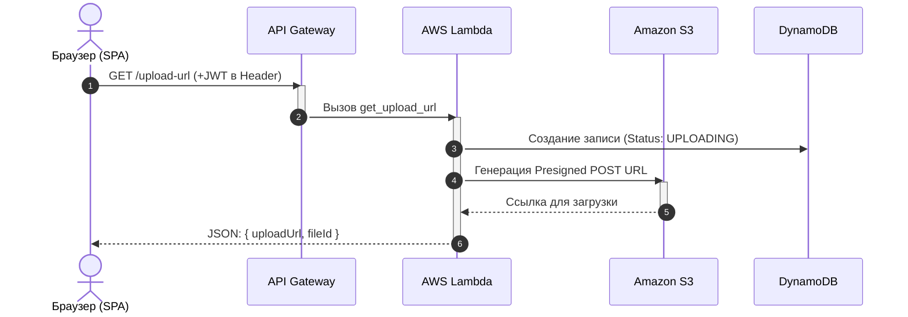
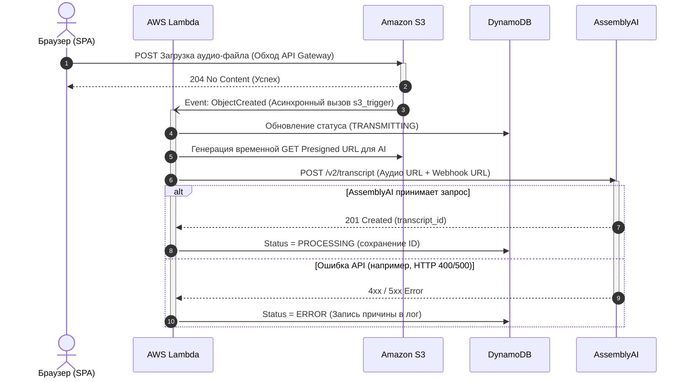
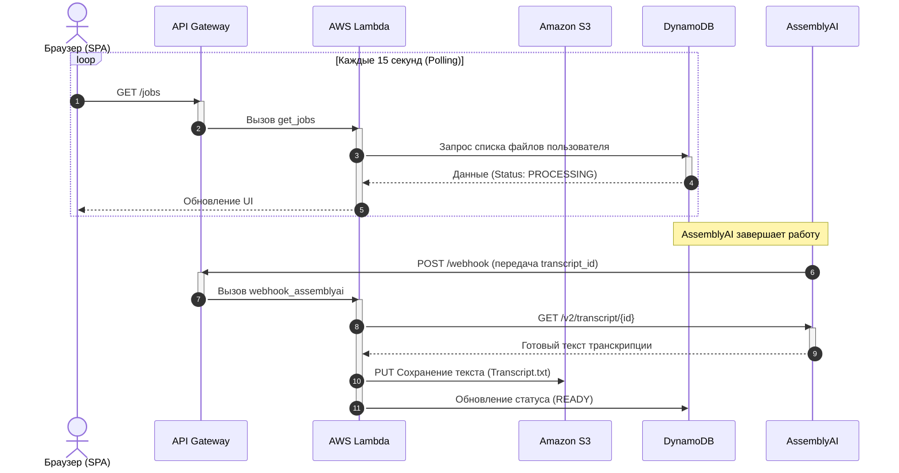
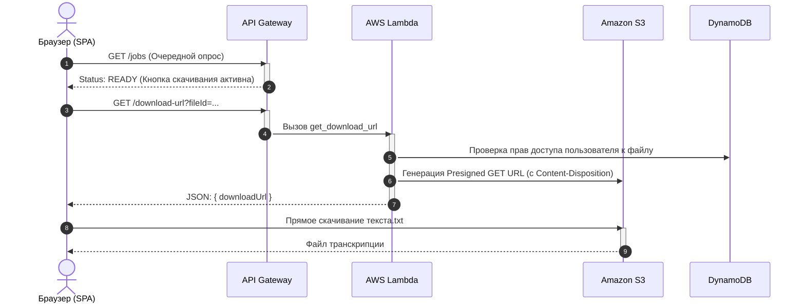

# Архитектура и интеграции

## Архитектура

## Архитектурная концепция

```mermaid
architecture-beta
    service dynamo(aws:dynamodb)[AWS DynamoDB]
    service lambda(aws:lambda)[AWS Lambda] 
    service api(aws:api-gateway)[AWS API Gateway]
    service static(aws:simple-storage-service)[Static website at Amazon S3]
    service storage(aws:simple-storage-service)[File storage at Amazon S3]
    service browser(logos:chrome)[Browser]
    service cognito(aws:cognito)[AWS Cognito]
    service ai(logos:webhooks)[AssemblyAI API]
    service front(aws:cloudfront)[AWS CloudFront]

    front:T -- B:static
    browser:T -- B:api
    browser:L -- R:front
    browser:B -- T:cognito

    api:R -- L:lambda
    api:T <-- B:ai
    lambda:T -- R:ai
    lambda:R -- L:dynamo
    lambda:B -- T:storage
    storage:L -- R:browser
```

## Потоки интеграции

## Диаграммы последовательности

### Отправка файла аудио

### Прямая загрузка и Асинхронный Триггер (Event-Driven)

### Обработка ИИ и Webhook (до нескольких минут)

### Получение результата (Скачивание)

