# Безопасность, качество и эксплуатация

## Модель безопасности и доступа

| Зона | Риск | Контроль |
|---|---|---|
| Authentication | доступ постороннего пользователя | Cognito Hosted UI, JWT validation |
| Authorization | скачивание чужого transcript | owner check в DynamoDB перед выдачей presigned GET URL |
| Upload | загрузка слишком большого/неподдерживаемого файла | client-side и backend-side validation, content-type/size constraints |
| S3 access | прямой публичный доступ к файлам | private buckets, presigned URLs only |
| Webhook | поддельный callback | shared secret / provider verification |
| Secrets | утечка provider API key | Secrets Manager / encrypted env, no secrets in code |
| Logs | попадание приватных данных в logs | не логировать transcript/audio content, только status/error metadata |
| Cost abuse | массовый запуск дорогих job | ограничение пользователей, quotas, AWS budget alerts |

## Требования к доступу

- Необходимо обеспечить ограничение доступа к сервису.
- Необходимо обеспечить разделение пользовательских данных.

## Аутентификация - AWS Cognito

* **Разделение пользовательских данных:** AWS Cognito - встроенный менеджмент учётных записей, регистрация, 2FA, защита от брутфорса и т.п. Сервис бесшовно встроен в экосистему AWS.
* Проверка прав пользователя на файл при скачивании (`get_download_url` проверяет доступ в DynamoDB перед выдачей Presigned URL).

### Аутентификация

```mermaid
sequenceDiagram
    autonumber
    
    actor U as Браузер (SPA)
    participant API as API Gateway
    participant C as Amazon Cognito

    U->>API: Запрос к API (без JWT / протухший JWT)
    activate API
    API-->>U: 401 Unauthorized
    deactivate API
    U->>U: SPA очищает локальные данные
    U->>C: Редирект на Hosted UI форму логина
    activate C
    C->>U: Форма логина 
    deactivate C
    U->>C: Ввод данных и попытка аутентификации
    activate C
    alt Некорректные реквизиты
        C-->>U: Возврат ошибки (Invalid credentials)
    else Корректные реквизиты
        C-->>U: Возврат Auth Code (через redirect_uri)
        deactivate C
        U->>C: POST /oauth2/token (Обмен Code на JWT)
        activate C
        C-->>U: Access & ID Tokens
        deactivate C
    end
```

## Режимы отказа

| Режим отказа | Последствие | Обнаружение | Митигация / восстановление |
|---|---|---|---|
| Lambda timeout при синхронной транскрибации | job не завершается | логи Lambda | async workflow + webhook |
| Ошибка provider API 4xx/5xx | job переходит в ERROR | логи провайдера | сохранить reason, показать статус пользователю |
| Webhook не пришёл | задача зависает в PROCESSING | UI | попытка перезапуска через новую задачу |
| Повторный webhook | возможная перезапись результата | двойной коллбэк | идемпотентная запись через transcriptId |
| Пользователь пытается скачать чужой transcript | утечка данных | проверка прав не пройдена | проверка владельца перед выдачей предподписанной URL |
| Presigned URL истёк | пользователь не может загрузить/скачать файл | ошибка на клиенте | сгенерировать новую предподписанную URL |
| S3 upload не завершился | задача остаётся в UPLOADING | зависший UPLOADING статус | TTL очистка / повторная попытка загрузки |
| Утечка API key | несанкционированные расходы | AWS уведомления о превышении квот | ротация ключей, сброс квот, ограничение бюджета на счету провайдера транскрибации + выключение овердрафта |
| Рост стоимости из-за массовых задач | неожиданный счет | AWS Budgets / CloudWatch | квоты, лимит на одновременность, ограничение бюджета на счету провайдера транскрибации + выключение овердрафта |
| Транскрипт сохранён, но статус не обновлён | UI не показывает готовый результат | UI не показывает готовый результат | проверка целостности / дебаг логики задач |

## Оценка масштаба и стоимости
### Предполагаемая нагрузка

| Параметр | Значение |
|---|---:|
| Пользователи | 1–3 |
| Аудио в месяц | до 40 часов |
| Средняя длина файла | 1.5+ часа |
| Максимальная длина файла | 6 часов |
| Максимальный размер файла | 300 MB |
| Параллельные job | до 5 |

### Драйверы стоимости

| Компонент | Что влияет на стоимость |
|---|---|
| Transcription provider | минуты/часы аудио |
| S3 | объём аудио и transcript files |
| DynamoDB | количество job/status reads |
| Lambda | количество invocation и длительность handlers |
| API Gateway | количество API-запросов |
| CloudFront/S3 static hosting | frontend traffic |
| Secrets Manager | хранение provider API key |
| CloudWatch | logs retention |

### Логика расчета стоимости

Основная стоимость находится не в AWS compute, а во внешнем transcription provider. AWS Lambda, API Gateway, DynamoDB и S3 при заданном профиле нагрузки остаются вторичными cost drivers. Поэтому архитектура оптимизирована не под высокую нагрузку, а под минимальные постоянные расходы и отсутствие простаивающей инфраструктуры.
