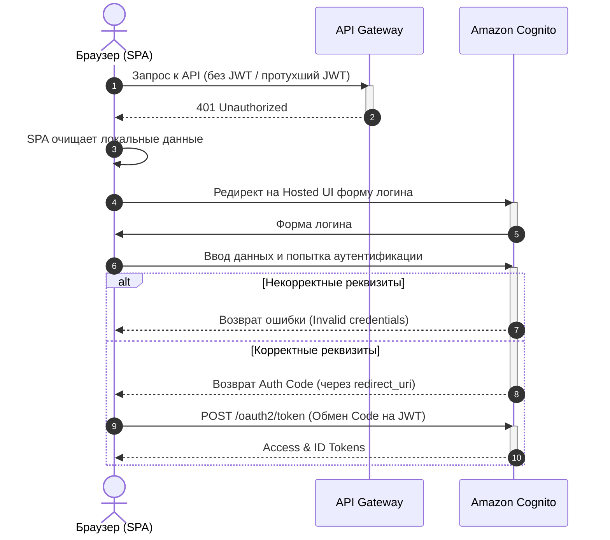

# Безопасность, качество и эксплуатация

## Модель безопасности и доступа

## Требования к доступу

- Необходимо обеспечить ограничение доступа к сервису.
- Необходимо обеспечить разделение пользовательских данных.

## Аутентификация - AWS Cognito

* **Разделение пользовательских данных:** AWS Cognito - встроенный менеджмент учётных записей, регистрация, 2FA, защита от брутфорса и т.п. Сервис бесшовно встроен в экосистему AWS.
* Проверка прав пользователя на файл при скачивании (`get_download_url` проверяет доступ в DynamoDB перед выдачей Presigned URL).

### Аутентификация

## Нефункциональные требования

- Доступность с любого устройства, подключенного к сети интернет.
- Одновременная обработка до 5 файлов.
- Размер файла записи - до 300мб.
- Продолжительность записи - до 6 часов.
- Оптимально минимальное использование инфраструктуры.

## Режимы отказа

## Таймаут Lambda vs длительная транскрибация

Сторонний API может транскрибировать дольше, чем допускает одно выполнение Lambda. Синхронное ожидание результата внутри одной функции приведёт к таймауту.

**Смягчение:** развязка по времени - клиент загружает аудио, Lambda отправляет запрос в AssemblyAI с webhook URL, отдельный обработчик webhook получает готовый текст при callback. UI опрашивает `GET /jobs` до статуса `READY`.

## Ошибки API AssemblyAI

При отклонении или сбое запроса (HTTP 4xx/5xx) запись обновляется до `ERROR`, причина фиксируется в логе.

## Оценка масштаба и стоимости

* **Нагрузка:** не более 40 часов записей в месяц.
* **Пользователи:** 1–3 пользователя.
* **Типичный профиль файла:** большие аудио (1.5ч+), до 300мб и 6 часов.
* **Параллелизм:** до 5 файлов одновременно.
* **Экономика:** serverless pay-per-use для минимизации затрат на простаивающую инфраструктуру при эпизодическом использовании.
