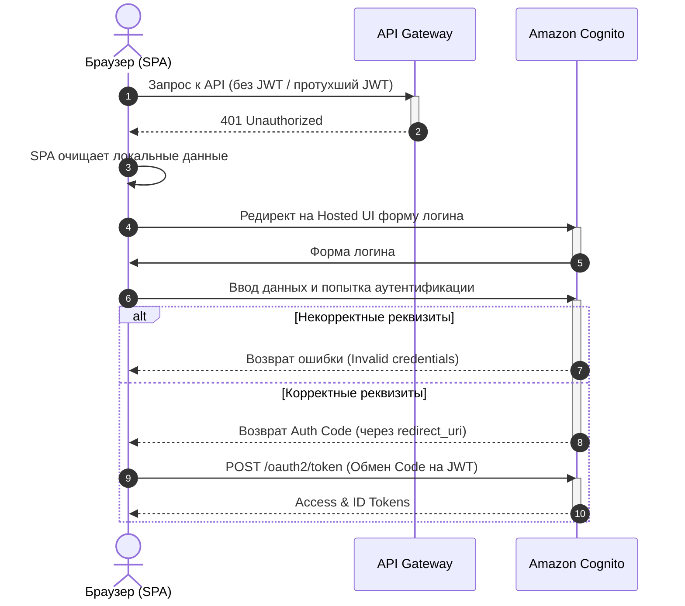

# Модель безопасности и доступа

## Требования к доступу

- Необходимо обеспечить ограничение доступа к сервису.
- Необходимо обеспечить разделение пользовательских данных.

## Аутентификация - AWS Cognito

* **Разделение пользовательских данных:** AWS Cognito - встроенный менеджмент учётных записей, регистрация, 2FA, защита от брутфорса и т.п. Сервис бесшовно встроен в экосистему AWS.
* Проверка прав пользователя на файл при скачивании (`get_download_url` проверяет доступ в DynamoDB перед выдачей Presigned URL).

### Аутентификация

